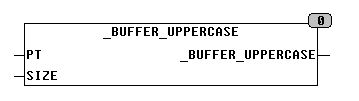

<!--
  Copyright (c) 2026 Hans Mühlbauer, Franz Höpfinger and others.

  This program and the accompanying materials are made available under the
  terms of the Eclipse Public License 2.0 which is available at
  https://www.eclipse.org/legal/epl-2.0

  SPDX-License-Identifier: EPL-2.0
-->

## _BUFFER_UPPERCASE

| | |
|:---|:---|
| **Type	Funktion** | BOOL |
| **Input	PT** | POINTER TO BYTE (Adresse des Puffers) |
| **SIZE** | UINT (Größe des Puffers) |
| **Output** | BOOL (Returns TRUE) |
| **Die Funktion _BUFFER_UPPERCASE interpretiert jedes Byte im Buffer als ASCII Zeichen und wandelt es in Großbuchstaben um. Beim Aufruf wird der Funktion ein Pointer auf das zu initialisierende Array und dessen Größe in Bytes übergeben. Unter CoDeSys lautet der Aufruf** | _BUFFER_INIT(ADR(Array), SIZEOF(Array), INIT), wobei Array der Name des zu manipulierenden Arrays ist. ADR ist eine Standardfunktion, die den Pointer auf das Array ermittelt und SIZEOF ist eine Standardfunktion, die die Größe des Arrays ermittelt. Die Funktion liefert nur TRUE zurück. Das durch den Pointer angegebene Array wird direkt im Speicher manipuliert. |
| | Diese Art der Bearbeitung von Arrays ist äußerst effizient, da kein zusätzlicher Speicher benötigt wird und keine Übergabewerte kopiert werden müssen. |



**Beispiel:**

```iecst
_BUFFER_UPPERCASE(ADR(bigarray), SIZEOF(bigarray))
```
