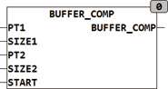

<!--
  Copyright (c) 2026 Hans Mühlbauer, Franz Höpfinger and others.

  This program and the accompanying materials are made available under the
  terms of the Eclipse Public License 2.0 which is available at
  https://www.eclipse.org/legal/epl-2.0

  SPDX-License-Identifier: EPL-2.0
-->

## BUFFER_COMP

| | |
|:---|:---|
| **Type	Funktion** | INT |
| **Input	PT1** | POINTER (Adresse des ersten Puffers) |
| **SIZE1** | INT (Größe des ersten Puffers) |
| **PT2** | POINTER (Adresse des zweiten Puffers) |
| **SIZE2** | INT (Größe des zweiten Puffers) |
| **START** | INT (Suchbeginn ab Start) |
| **Output** | INT (gefundene Position) |
| | Die Funktion BUFFER_COMP überprüft ob der Inhalt des Arrays PT2 im Array PT1 ab der Position START vorkommt. Wird PT2 in PT1 gefunden, so gibt die Funktion die Position in PT1 beginnend bei 0 an. Wird PT2 nicht in PT1 gefunden, wird -1 zurückgegeben. BUFFER_COMP kann auch zum Vergleich von 2 gleichgroßen Arrays verwendet werden. |
| **Beim Aufruf wird der Funktion ein Pointer auf das zu bearbeitende Array und dessen Größe in Bytes übergeben. Unter CoDeSys lautet der Aufruf** | BUFFER_COMP(ADR(BUF1), SIZEOF(BUF1), ADR(BUF2), SIZEOF(BUF2)), wobei BUF1 und BUF2 die Namen des zu manipulierenden Arrays sind. ADR ist eine Standardfunktion, die den Pointer auf das Array ermittelt und SIZEOF ist eine Standardfunktion, die die Größe des Arrays ermittelt. Die Funktion liefert nur TRUE zurück. Das durch den Pointer angegebene Array wird direkt im Speicher manipuliert. Diese Art der Bearbeitung von Arrays ist äußerst effizient, da kein zusätzlicher Speicher benötigt wird und keine Übergabewerte kopiert werden müssen. |



**Beispiel:**

```iecst
BUFFER_COMP(ADR(BUF1), SIZEOF(BUF1), ADR(BUF2), SIZEOF(BUF2))
```
