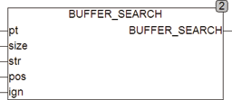

<!--
  Copyright (c) 2026 Hans Mühlbauer, Franz Höpfinger and others.

  This program and the accompanying materials are made available under the
  terms of the Eclipse Public License 2.0 which is available at
  https://www.eclipse.org/legal/epl-2.0

  SPDX-License-Identifier: EPL-2.0
-->

## BUFFER_SEARCH

| | |
|:---|:---|
| **Type	Funktion** | INT |
| **Input	PT** | POINTER (Adresse des Puffers) |
| **SIZE** | UINT (Größe des Puffers) |
| **STR** | STRING (Suchstring) |
| **POS** | INT (Position ab der gesucht wird) |
| **IGN** | BOOL (Search Groß / Kleinschreibung) |
| **Output** | INT (Position an der die Zeichenkette gefunden wurde) |
| **Die Funktion BUFFER_SEARCH durchsucht ein beliebiges Array of Byte auf den Inhalt einer Zeichenkette und meldet die Position des ersten Zeichens der Zeichenkette im Array wenn eine Übereinstimmung gefunden wird. Der Puffer wird ab einer beliebigen Position POS durchsucht. Das erste Element im Array hat die Positionsnummer 0. Beim Aufruf wird der Funktion ein Pointer auf das zu bearbeitende Array und dessen Größe in Bytes übergeben. Unter CoDeSys lautet der Aufruf** | BUFFER_SEARCH(ADR(Array), SIZEOF(ARRAY), STR, POS, IGN), wobei ARRAY der Name des Arrays ist. ADR ist eine Standardfunktion, die den Pointer auf das Array ermittelt und SIZEOF ist eine Standardfunktion, die die Größe des Arrays ermittelt. Die Funktion liefert die aus dem Puffer kopierte Zeichenkette als STRING zurück. Diese Art der Bearbeitung von Arrays ist äußerst effizient, da kein zusätzlicher Speicher benötigt wird und keine Übergabewerte kopiert werden müssen. Wenn IGN = TRUE werden sowohl Groß- als auch Klein-buchstaben als Übereinstimmung gefunden, STR muss dabei in Großbuchstaben vorhanden sein. Wenn IGN = FALSE wird Case sensitiv gesucht. |



**Beispiel:**

```iecst
BUFFER_SEARCH(ADR(Array), SIZEOF(ARRAY), 'FIND', 0, TRUE) Findet 'FIND', 'Find', 'find' .... im Array. Beispiel: BUFFER_SEARCH(ADR(Array), SIZEOF(ARRAY), 'FIND', 0, FALSE) Findet nur 'FIND' im Array.
```
