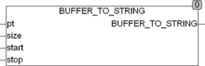

<!--
  Copyright (c) 2026 Hans Mühlbauer, Franz Höpfinger and others.

  This program and the accompanying materials are made available under the
  terms of the Eclipse Public License 2.0 which is available at
  https://www.eclipse.org/legal/epl-2.0

  SPDX-License-Identifier: EPL-2.0
-->

## Type	Funktion : STRING

| | |
|:---|:---|
| **Input	PT** | POINTER TO BYTE (Adresse des Puffers) |
| **SIZE** | UINT (Größe des Puffers) |
| **START** | UINT (Position ab der der String aus dem Puffer |
| | kopiert wird) |
| **STOP** | UINT (Ende des Strings im Puffer) |
| **Output** | STRING (Zeichenkette die aus dem Puffer kopiert wurde) |
| **Die Funktion BUFFER_TO_STRING extrahiert einen String aus einem beliebigen Array of Byte. Der String wird ab einer beliebigen Position START aus dem Puffer kopiert und endet an der Position STOP. Das erste Element im Array hat die Positionsnummer 0. Beim Aufruf wird der Funktion ein Pointer auf das zu bearbeitende Array und dessen Größe in Bytes übergeben. Unter CoDeSys lautet der Aufruf** | BUFFER_TO_STRING(ADR(Array), SIZEOF(ARRAY), START, STOP), wobei ARRAY der Name des Arrays ist. ADR ist eine Standardfunktion, die den Pointer auf das Array ermittelt und SIZEOF ist eine Standardfunktion, die die Größe des Arrays ermittelt. Die Funktion liefert die aus dem Puffer kopierte Zeichenkette als STRING zurück. Diese Art der Bearbeitung von Arrays ist äußerst effizient, da kein zusätzlicher Speicher benötigt wird und keine Übergabewerte kopiert werden müssen. Beispiel:	BUFFER_TO_STRING(ADR(Array), SIZEOF(ARRAY), START, STOP) |

