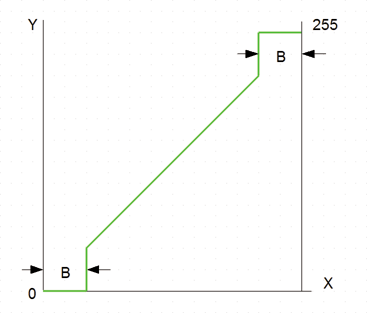

<!--
  Copyright (c) 2026 Hans Mühlbauer, Franz Höpfinger and others.

  This program and the accompanying materials are made available under the
  terms of the Eclipse Public License 2.0 which is available at
  https://www.eclipse.org/legal/epl-2.0

  SPDX-License-Identifier: EPL-2.0
-->

## Type	Funktion : BYTE

| | |
|:---|:---|
| **Input	X** | BYTE (Eingangswert) |
| **B** | BYTE (Begrenzungsbereich) |
| **Output** | BYTE (Ausgangswert) |
| | BAND_B blendet von Eingangsbereich 0..255 die Bereiche 0..B und 255-B..255 aus, in diesen Bereichen wird der Ausgang 0 beziehungsweise 255. |

