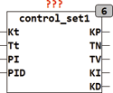

<!--
  Copyright (c) 2026 Hans Mühlbauer, Franz Höpfinger and others.

  This program and the accompanying materials are made available under the
  terms of the Eclipse Public License 2.0 which is available at
  https://www.eclipse.org/legal/epl-2.0

  SPDX-License-Identifier: EPL-2.0
-->

## Type	Funktionsbaustein

| | |
|:---|:---|
| **Input	KT** | REAL (Kritische Verstärkung) |
| **TT** | REAL (PeriodendauerderkritischenSchwingung) |
| **PI** | BOOL (TRUE wenn Parameter für PI Regler bestimmt sind) |
| **PID** | BOOL (TRUE wenn Parameter für PID Regler) |
| **Output	KP** | REAL (Regelverstärkung KP) |
| **TN** | REAL (Nachstellzeit des Integrators) |
| **TV** | REAL (Vorhaltezeit des Differenzierers) |
| **KI** | REAL ( Verstärkungsfaktor des Integrators) |
| **KD** | REAL (Verstärkungsfaktor des Differenzierers) |
| | CONTROL_SET1 berechnet Einstellparameter für P, PI und PID Controller nach den Ziegler-Nichols Verfahren. Hierbei wird die kritische Verstärkung KT, und die Periodendauer der kritischen Schwingung TT angegeben. Die Parameter werden ermittelt indem der Regler als reiner P-Regler  betrieben wird und die Verstärkung solange hochgefahren wird bis eine Dauerschwingung konstanter Amplitude einsetzt. Die entsprechenden Werte KT und TT werden dann ermittelt. Nachteil dieses Verfahrens ist das nicht jeder reale Regelkreis an die Stabilitätsgrenze gefahren werden kann, und  das diese verfahren für langsame Regelkreise wie Raumregelungen sehr viel Zeit in Anspruch nimmt. |
| | Die Vorgabewerte der Einstellregeln sind in Setup Variablen definiert und können vom Anwender verändert werden. Die folgende Tabelle zeigt die Default Werte |
| **Setup	P_K** | REAL := 0.5 (Vorgabewert KP für P Regler) |
| **PI_K** | REAL := 0.45 ( Vorgabewert KP für PI Regler |
| **PI_TN** | REAL := 0.83 (Vorgabewert TN für PI Regler) |
| **PID_K** | REAL := 0.6 (Vorgabewert KP für PID Regler) |
| **PID_TN** | REAL := 0.5 (Vorgabewert TN für PID Regler) |
| **PID_TV** | REAL := 0.125 (Vorgabewert TV für PID Regler) |

| Reglertyp | PI | PID | KP | TN | TV |
| --- | --- | --- | --- | --- | --- |
| P-Regler | 0 | 0 | P_K * KT |  |  |
| PI-Regler | 1 | 0 | PI_K * KT | PI_TN * TT |  |
| PID-Regler | 0 | 1 | PID_K * KT | PID_TN * TT | PID_TV * TT |

| Reglertyp | PI | PID | KP | TN | TV |
| --- | --- | --- | --- | --- | --- |
| P-Regler | 0 | 0 | P_K = 0.5 |  |  |
| PI-Regler | 1 | 0 | PI_K = 0.45 | PI_TN = 0.83 |  |
| PID-Regler | 0 | 1 | PID_K = 0.6 | PID_TN = 0.5 | PID_TV = 0.125 |
