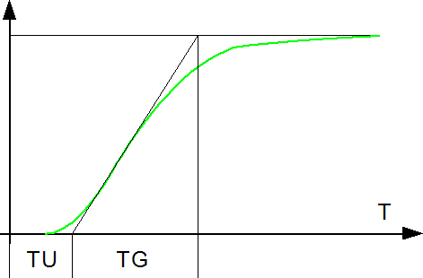

<!--
  Copyright (c) 2026 Hans Mühlbauer, Franz Höpfinger and others.

  This program and the accompanying materials are made available under the
  terms of the Eclipse Public License 2.0 which is available at
  https://www.eclipse.org/legal/epl-2.0

  SPDX-License-Identifier: EPL-2.0
-->

## Type	Funktionsbaustein

| | |
|:---|:---|
| **Input	KT** | REAL (Kritische Verstärkung) |
| **TT** | REAL (PeriodendauerderkritischenSchwingung) |
| **PI** | BOOL (TRUE wenn Parameter für PI Regler bestimmt sind) |
| **PID** | BOOL (TRUE wenn Parameter für PID Regler) |
| **Config	P_K** | REAL := 0.5 (Vorgabewert KP für P Regler) |
| **PI_K** | REAL := 0.45 ( Vorgabewert KP für PI Regler |
| **PI_TN** | REAL := 0.83 (Vorgabewert TN für PI Regler) |
| **PID_K** | REAL := 0.6 (Vorgabewert KP für PID Regler) |
| **PID_TN** | REAL := 0.5 (Vorgabewert TN für PID Regler) |
| **PID_TV** | REAL := 0.125 (Vorgabewert TV für PID Regler) |
| **Output	KP** | REAL (Regelverstärkung KP) |
| **TN** | REAL (Nachstellzeit des Integrators) |
| **TV** | REAL (Vorhaltezeit des Differenzierers) |
| **KI** | REAL ( Verstärkungsfaktor des Integrators) |
| **KD** | REAL (Verstärkungsfaktor des Differenzierers) |
| | CONTROL_SET2 berechnet Einstellparameter für P, PI und PID Controller nach den Ziegler-Nichols Verfahren. Hierbei wird die Verzugszeit TU und die Ausgleichszeit TG angegeben. Die Parameter werden ermittelt indem die Sprungantwort der Regelstrecke gemessen wird. TU entspricht der Zeit nach der der Ausgang der Regelstrecke 5% seines Maximalwertes erreicht hat. TG ist die Zeit die Zeit der Wendetangente der Regelstrecke. KS ist Istwertänderung der Regelstrecke / Stellgrößenveränderung. |
| **Die folgende Grafik zeigt die Ermittlung von TU und TG mit dem Wendetangentenverfahren** |  |
| **Die Vorgabewerte der Einstellregeln sind in Config Variablen definiert und können vom Anwender verändert werden. Die folgende Tabelle zeigt die Default Werte** |  |

| Reglertyp | PI | PID | KP | TN | TV |
| --- | --- | --- | --- | --- | --- |
| P-Regler | 0 | 0 | P_K * TG / TU / KS |  |  |
| PI-Regler | 1 | 0 | PI_K * TG / TU / KS | PI_TN * TU |  |
| PID-Regler | 0 | 1 | PID_K * TG / TU / KS | PID_TN * TU | PID_TV * TU |

| Reglertyp | PI | PID | KP | TN | TV |
| --- | --- | --- | --- | --- | --- |
| P-Regler | 0 | 0 | P_K = 1.0 |  |  |
| PI-Regler | 1 | 0 | PI_K = 0.9 | PI_TN = 3.33 |  |
| PID-Regler | 0 | 1 | PID_K = 1.2 | PID_TN = 2 | PID_TV = 0.5 |
