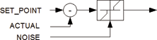

<!--
  Copyright (c) 2026 Hans Mühlbauer, Franz Höpfinger and others.

  This program and the accompanying materials are made available under the
  terms of the Eclipse Public License 2.0 which is available at
  https://www.eclipse.org/legal/epl-2.0

  SPDX-License-Identifier: EPL-2.0
-->

## Type	Funktion : REAL

| | |
|:---|:---|
| **Input	SET_POINT** | REAL (Vorgabewert) |
| **ACTUAL** | REAL (Prozesswert) |
| **NOISE** | REAL (Ansprechschwelle) |
| **Output** | REAL (Prozessabweichung) |
| | CTRL_IN berechnet die Prozessabweichung (SET_POINT _ ACTUAL) und gibt diese am Ausgang aus. Ist die Abweichung kleiner als der Wert am Eingang NOISE bleibt der Ausgang auf 0. CTRL_IN kann benutzt werden um eigene Regelbausteine Aufzubauen. |
| **Blockschaltbild von CTRL_IN** |  |

