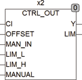
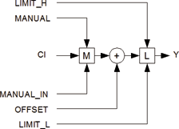

<!--
  Copyright (c) 2026 Hans Mühlbauer, Franz Höpfinger and others.

  This program and the accompanying materials are made available under the
  terms of the Eclipse Public License 2.0 which is available at
  https://www.eclipse.org/legal/epl-2.0

  SPDX-License-Identifier: EPL-2.0
-->

## Type	Funktionsbaustein

| | |
|:---|:---|
| **Input	CI** | REAL (Eingang vom Controller) |
| **OFFSET** | REAL (Ausgangsoffset) |
| **MAN_IN** | REAL (Manueller Eingangswert) |
| **LIM_L** | REAL (untere Ausgangsbegrenzung) |
| **LIM_H** | REAL (obere Ausgangsbegrenzung) |
| **MANUAL** | BOOL (Umschalter für Handbetrieb) |
| **Output	Y** | REAL (Steuersignal) |
| **LIM** | BOOL (TRUE wenn Steuersignal ein Limit erreicht) |
| | CTRL_OUT addiert zum Eingang CI den Wert von OFFSET und gibt das Ergebnis auf Y aus wenn MANUAL = FALSE. Wenn MANUAL = TRUE wird am Ausgang Y Der Eingangswert von MAN_IN + OFFSET ausgegeben. Y wird jederzeit auf die durch LIM_L und LIM_H definierten Grenzen begrenzt. Erreicht Y eine der Grenzen, so wird der Ausgang LIM TRUE. CTRL_OUT kann benutzt werden um eigene Regelbausteine Aufzubauen. |
| **Blockschaltbild von CTRL_OUT** |  |

