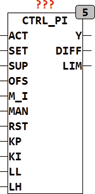
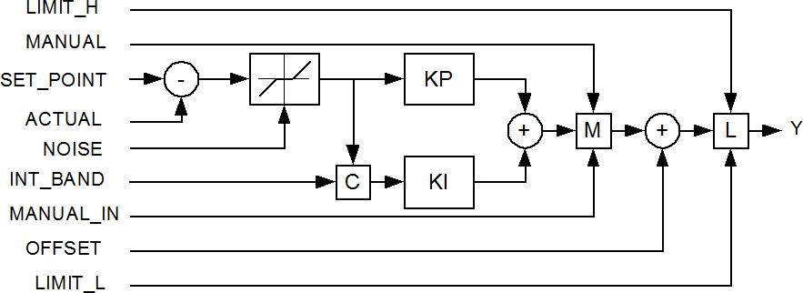

<!--
  Copyright (c) 2026 Hans Mühlbauer, Franz Höpfinger and others.

  This program and the accompanying materials are made available under the
  terms of the Eclipse Public License 2.0 which is available at
  https://www.eclipse.org/legal/epl-2.0

  SPDX-License-Identifier: EPL-2.0
-->

## Type	Funktionsbaustein

| | |
|:---|:---|
| **Input	ACT** | REAL (gemessener Wert nach der Strecke) |
| **SET** | REAL (Vorgabewert) |
| **SUP** | REAL (Rauschunterdrückung) |
| **OFS** | REAL (Offset für den Ausgang) |
| **M_I** | REAL (Eingangswert für manuellen Betrieb) |
| **MAN** | BOOL (Umschalten auf Handbetrieb, MANUAL = TRUE) |
| **RST** | BOOL (Asynchroner Reset-Eingang) |
| **KP** | REAL (Proportionaler Anteil des Reglers) |
| **KI** | REAL (Integraler Anteil des Reglers) |
| **LL** | REAL (untere Ausgangsbegrenzung) |
| **LH** | REAL (obere Ausgangsbegrenzung) |
| **Output	Y** | REAL (Ausgang des Reglers) |
| **DIFF** | Real (Regelabweichung) |
| **LIM** | BOOL (TRUE, wenn der Ausgang ein Limit erreicht hat) |
| **CTRL_PI ist ein PI-Regler mit dynamischen Anti Wind-Up und manuellem Steuereingang. Der PI Regler arbeitet nach der Formel** |  |
| | Y = KP * DIFF + KI * INTEG(DIFF) + OFFSET |
| | wobei DIFF = SET_POINT – ACTUAL |
| **Im Handbetrieb (Manual = TRUE) gilt** | Y = MANUAL_IN + OFFSET |
| **ACT ist der gemessene Wert nach der Regelstrecke und Set ist die Sollwertvorgabe für den Regler. Die Eingangswerte LH und LL begrenzen den Ausgangswert Y. Mit RST kann der interne Integrator jederzeit auf 0 gesetzt werden. Der Ausgang LIM signalisiert das der Regler an eine der Grenzen LL oder LH gelaufen ist. Der PI-Regler arbeitet frei laufend und benutzt zur Berechnung des Integrators die Trapezregel für höchste Genauigkeit und optimale Geschwindigkeit. Die Default-Werte der Eingangsparameter sind wie folgt vordefiniert** | KP = 1, KI = 1, LIMIT_L = -1000 und LIMIT_H = +1000. Mit dem Eingang SUP wird eine Rauschunterdrückung eingestellt, der Wert am Eingang SUP legt fest ab welcher Regeldifferenz der Regler einschaltet. Mit SUP wird vermieden das der Ausgang des Reglers  dauern schwankt. Der Wert am Eingang SUP sollte so bemessen sein das er das Rauschen der Regelstrecke und der Sensoren unterdrückt. Wird zum Beispiel der Eingang SUP auf 0.1 gesetzt so wird der Regler erst bei Regelabweichungen größer als 0.1 aktiv. Der Ausgang DIFF stellt die gemessene und durch ein Noise Filter (DEAD_BAND) gefilterte Regelabweichung zur Verfügung. DIFF wird in einer Regelstrecke normalerweise nicht benötigt, kann aber zur Beeinflussung der Regelparameter benutzt werden. Der Eingang OFS wird als letzter Wert zum Ausgang addiert, und dient vor allem zum kompensieren von Störsignalen, deren Wirkung auf den Regelkreis abgeschätzt werden kann. |
| | Der Regler arbeitet mit einem Dynamischen Wind-Up das verhindert dass der Integrator bei erreichen eines Ausgangslimits und weiterer Regelabweichung unbegrenzt weiter läuft und die Regeleigenschaften negativ beeinflusst. In der Einleitung des Kapitel Regelungstechnik finden sich weitere Details zum Thema Anti Wind-Up. |
| **Die folgende Grafik verdeutlicht die interne Struktur des Reglers** |  |

