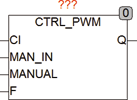

<!--
  Copyright (c) 2026 Hans Mühlbauer, Franz Höpfinger and others.

  This program and the accompanying materials are made available under the
  terms of the Eclipse Public License 2.0 which is available at
  https://www.eclipse.org/legal/epl-2.0

  SPDX-License-Identifier: EPL-2.0
-->

## CTRL_PWM

| | |
|:---|:---|
| **Type** | Funktionsbaustein |
| **Input	CI** | REAL (Eingang vom Controller) |
| **MAN_IN** | REAL (Manueller Eingangswert) |
| **MANUAL** | BOOL (Umschalter für Handbetrieb) |
| **F** | REAL (Frequenz der Ausgangsimpulse in Hz) |
| **Output	Q** | BOOL (Steuersignal) |
| | CTRL_PWM wandelt den Eingangswert CI (0..1) in ein Pulsweitenmoduliertes Ausgangssignal Q. Wenn MANUAL = TRUE wird am Ausgang Q Der Eingangswert von MAN_IN ausgegeben. CTRL_OUT kann benutzt werden um eigene Regelbausteine Aufzubauen. |
| **Blockschaltbild von CTRL_PWM** |  |
| **DAS folgende Beispiel zeigt einen PI Regler mit PWM Ausgang** |  |

