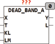

<!--
  Copyright (c) 2026 Hans Mühlbauer, Franz Höpfinger and others.

  This program and the accompanying materials are made available under the
  terms of the Eclipse Public License 2.0 which is available at
  https://www.eclipse.org/legal/epl-2.0

  SPDX-License-Identifier: EPL-2.0
-->

## Type	Funktionsbaustein

| | |
|:---|:---|
| **Input	X** | REAL (Eingangswert) |
| **T** | TIME (Verzögerungszeit des Tiefpasses) |
| **KL** | REAL (Verstärkung des Filters) |
| **LM** | REAL (Maximalwert der HF Amplitude) |
| **Output	Y** | REAL (Ausgangswert) |
| **L** | REAL (Amplitude der Hochfrequenz) |
| | DEAD_BAND_A ist eine selbst adaptierende lineare Übertragungsfunktion mit Totzone. Die Funktion verschiebt den positiven Teil der Kurve um -L und den negativen Teil der Kurve um +L. DEAD_BAND_A wird benutzt um Rauschanteile um den Nullpunkt aus einem Signal zu filtern. DEAD_BAND_A wird zum Beispiel in Regelkreisen eingesetzt um zu verhindern das der Regler dauernd in kleinen Schritten schaltet und dabei das Stellglied übermäßig belastet und abnutzt. |
| | Die Größe L wird berechnet indem aus dem Eingangssignal X die HF Anteile über einen Tiefpaß mit der Zeitkonstante T gefiltert werden und aus der Amplitude des HF Anteils wird die Totzone L berechnet. Die Empfindlichkeit des Bausteins kann über den Parameter KL verändert werden. KL ist mit 1 vordefiniert und kann deshalb unbeschaltet beliben. Sinnvolle Werte für KL liegen zwischen 1 - 5. |
| | L = HF_Amplitude (effektiv)  * KL. |
| | Damit der Baustein auch bei extremen Betriebsbedingungen stabil bleibt wird über den Eingang LM der Maximalwert von L begrenzt. |
| | DEAD_BAND = X - SGN(X)*L wenn ABS(X) > L wenn ABS(X) > L |
| | DEAD_BAND = 0 wenn ABS(X) <= L |

