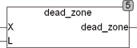
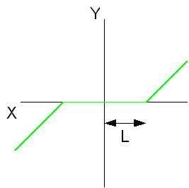

<!--
  Copyright (c) 2026 Hans Mühlbauer, Franz Höpfinger and others.

  This program and the accompanying materials are made available under the
  terms of the Eclipse Public License 2.0 which is available at
  https://www.eclipse.org/legal/epl-2.0

  SPDX-License-Identifier: EPL-2.0
-->

## Type	Funktion : REAL

| | |
|:---|:---|
| **Input	X** | REAL (Eingangswert) |
| **L** | REAL (Lockout Wert) |
| **Output** | REAL (Ausgangswert) |
| | DEAD_ZONE ist eine lineare Übertragungsfunktion mit Totzone. Der Ausgang entspricht dem Eingangssignal, wenn der Absolutwert des Eingangs größer als L ist. |
| | DEAD_ZONE = X wenn ABS(X) > L |
| | DEAD_ZONE = 0 wenn ABS(X) <= L |

