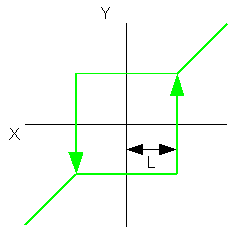

<!--
  Copyright (c) 2026 Hans Mühlbauer, Franz Höpfinger and others.

  This program and the accompanying materials are made available under the
  terms of the Eclipse Public License 2.0 which is available at
  https://www.eclipse.org/legal/epl-2.0

  SPDX-License-Identifier: EPL-2.0
-->

## Type	Funktionsbaustein

| | |
|:---|:---|
| **Input	X** | REAL (Eingangswert) |
| **L** | REAL (Lockout Wert) |
| **Output	Y** | REAL (Ausgangswert) |
| | DEAD_ZONE2 ist eine lineare Übertragungsfunktion mit Totzone und Hysterese. Der Ausgang entspricht dem Eingangssignal, wenn der Absolutwert des Eingangs größer als L ist. |
| | DEAD_ZONE2 = X wenn ABS(X) > L |
| | DEAD_ZONE2 = +/- L wenn ABS(X) <= L |

