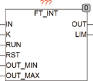
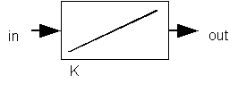

<!--
  Copyright (c) 2026 Hans Mühlbauer, Franz Höpfinger and others.

  This program and the accompanying materials are made available under the
  terms of the Eclipse Public License 2.0 which is available at
  https://www.eclipse.org/legal/epl-2.0

  SPDX-License-Identifier: EPL-2.0
-->

## Type	Funktionsbaustein

| | |
|:---|:---|
| **Input	IN** | REAL (Eingangssignal) |
| **K** | REAL (Multiplikator) |
| **RUN** | BOOL (Freigabe Eingang) |
| **RST** | BOOL (Reset Eingang) |
| **OUT_MIN** | REAL (unteres Ausgangs Limit) |
| **OUT_MAX** | REAL (oberes Ausgangs Limit) |
| **Output	OUT** | REAL (Ausgangssignal) |
| **LIM** | BOOL (TRUE wenn der Ausgang an einem Limit steht) |
| | FT_INT ist ein Integratorbaustein der das Integral über das Eingangssignal am Ausgang bereitstellt. Der Eingang K ist ein Multiplikator für das Ausgangssignal. Run schaltet den Integrator ein wenn TRUE und Aus wenn FALSE. RST (Reset) setzt den Ausgang auf 0. Die Eingänge OUT_MIN und OUT_MAX dienen dazu obere und untere Grenzwerte für den Ausgang des Integrators festzulegen. FT_INT  arbeitet intern in Mikrosekunden und wird dadurch auch den Anforderungen  sehr Schneller SPS Controller mit Zykluszeiten unter einer Millisekunde gerecht. |

| | Ein Grundsatzproblem bei Integratoren ist die Auflösung, So hat der Ausgang vom Typ Real eine Auflösung von 7-8 Stellen was zur Folge hat das bei einem errechneten Integrationsschritt von 1 bei einem Ausgangswert von größer als hundert Millionen (1E8) dieser Schritt nicht mehr aufaddiert werden kann da er unter die Auflösungsgrenze von maximal 8 Stellen beim Typ Real fällt. Diese Limitation ist bei Einsatz von FT_INT zu beachten. |

**Beispiel:**

Beispiel: ein Eingangssignal von 0,0001 bei einer Abtastzeit von 1 Millisekunde und einem Ausgangswert von 100000 würde einen Wert von 0,0001 * 0,001 Sekunden = 0,000001 zum Ausgangswert von 100000 addieren, was unweigerlich wieder den Wert von 100000 ergibt, denn die Auflösung des Datentyps Real kann nur maximal 8 Stellen erfassen. Dies ist vor allem zu beachten wenn FT_INT als Verbrauchszähler oder ähnlichen Anwendungen zum Einsatz kommen soll. Strukturbild:
