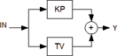

<!--
  Copyright (c) 2026 Hans Mühlbauer, Franz Höpfinger and others.

  This program and the accompanying materials are made available under the
  terms of the Eclipse Public License 2.0 which is available at
  https://www.eclipse.org/legal/epl-2.0

  SPDX-License-Identifier: EPL-2.0
-->

## Type	Funktionsbaustein

| | |
|:---|:---|
| **Input	IN** | REAL (Eingangssignal) |
| **KP** | REAL (Proportionaler Anteil des Reglers) |
| **TV** | REAL (Nachstellzeit des Differenzierers in Sekunden) |
| **Output	Y** | REAL (Ausgang des Reglers) |
| **FT_PD ist ein PD-Regler der nach folgender Formel arbeitet** |  |
| | Y = KP * (IN + DERIV(IN)) |
| | FT_PD kann zusammen mit den Bausteinen CTRL_IN und CTRL_OUT zum Aufbau eines PD Reglers benutzt werden. |
| **Die folgende Grafik verdeutlicht die interne Struktur des Reglers** |  |

