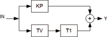

<!--
  Copyright (c) 2026 Hans Mühlbauer, Franz Höpfinger and others.

  This program and the accompanying materials are made available under the
  terms of the Eclipse Public License 2.0 which is available at
  https://www.eclipse.org/legal/epl-2.0

  SPDX-License-Identifier: EPL-2.0
-->

## Type	Funktionsbaustein

| | |
|:---|:---|
| **Input	IN** | REAL (Eingangssignal) |
| **KP** | REAL (Proportionaler Anteil des Reglers) |
| **TV** | REAL (Nachstellzeit des Differenzierers in Sekunden) |
| **T1** | REAL (T1 des PT1 Gliedes in Sekunden) |
| **Output	Y** | REAL (Ausgang des Reglers) |
| **FT_PDT1 ist ein PD-Regler mit T1 Glied im D-Anteil. Der Baustein arbeitet nach folgender Formel** |  |
| | Y = KP * (IN + PT1(DERIV(IN)) |
| | FT_PDT1 kann zusammen mit den Bausteinen CTRL_IN und CTRL_OUT sowie weiteren Regelungstechnischen Bausteinen zum Aufbau komplexer Reglerschaltungen benutzt werden. |
| **Interner Aufbau des Bausteins** |  |

