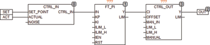

<!--
  Copyright (c) 2026 Hans Mühlbauer, Franz Höpfinger and others.

  This program and the accompanying materials are made available under the
  terms of the Eclipse Public License 2.0 which is available at
  https://www.eclipse.org/legal/epl-2.0

  SPDX-License-Identifier: EPL-2.0
-->

## Type	Funktionsbaustein

| | |
|:---|:---|
| **Input	IN** | REAL (Eingangssignal) |
| **KP** | REAL (Proportionaler Anteil des Reglers) |
| **KI** | REAL (Integraler Anteil des Reglers) |
| **ILIM_L** | REAL (untere Ausgangsbegrenzung des Integrators) |
| **ILIM_H** | REAL (obere Ausgangsbegrenzung des Integrators) |
| **IEN** | BOOL (Enable für den Integrator) |
| **RST** | BOOL (Asynchroner Reset-Eingang) |
| **Output	Y** | REAL (Ausgang des Reglers) |
| **LIM** | BOOL (TRUE, wenn der Ausgang ein Limit erreicht hat) |
| **FT_PI ist ein PI-Regler der nach folgender Formel arbeitet** |  |
| | Y = KP * IN + KI * INTEG(IN) |
| **Die Eingangswerte ILIM_H und ILIM_L begrenzen den Arbeitsbereich des internen Integrators. Mit RST kann der interne Integrator jederzeit auf 0 gesetzt werden. Der Ausgang LIM signalisiert das der Integrator an eine der Grenzen ILIM_L oder ILIM_H gelaufen ist. Der PI-Regler arbeitet frei laufend und benutzt zur Berechnung des Integrators die Trapezregel für höchste Genauigkeit und optimale Geschwindigkeit. Die Default-Werte der Eingangsparameter sind wie folgt vordefiniert** | KP = 1, KI = 1, ILIM_L = -1E38 und ILIM_H = +1E38. |
| **Anti Wind-Up** | Regelbausteine mit Interalanteil neigen zu dem so genannten Wind Up Effekt. Ein Wind-Up bedeutet das der Integratorbaustein kontinuierlich weiter läuft weil z.B. das Stellsignal Y an einem Anschlag steht und die Regelung über längere Zeit nicht in der Lage ist die Regelabweichung auszugleichen, was dann nach anschließendem Übergang in den Regelbereich erst zu einem langen und Zeitaufwendigen Abbau des Integratorwertes führt und die Regelung nur verzögert reagiert. Da der Integralanteil nur für den Ausgleich der Regelabweichung nach allen anderen Regelanteilen nötig ist, kann und sollte der Bereich des Integrators mit den Werten ILIM begrenzt werden. Der Integrator wird dann bei Erreichen eines Limits gestoppt und verharrt auf dem letzten gültigen Wert. Für andere Wind-Up Maßnahmen kann der Integrator jederzeit mit dem Eingang IEN = FALSE separat gesteuert werden, der Integrator läuft nur wenn IEN = TRUE. |
| **Die folgende Grafik verdeutlicht die interne Struktur des Reglers** |  |
| | FT_PI kann zusammen mit den Bausteinen CTRL_IN und CTRL_OUT zum Aufbau eines PI Reglers benutzt werden. |

