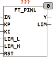
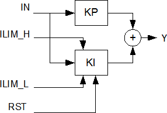

<!--
  Copyright (c) 2026 Hans Mühlbauer, Franz Höpfinger and others.

  This program and the accompanying materials are made available under the
  terms of the Eclipse Public License 2.0 which is available at
  https://www.eclipse.org/legal/epl-2.0

  SPDX-License-Identifier: EPL-2.0
-->

## Type	Funktionsbaustein

| | |
|:---|:---|
| **Input	IN** | REAL (Eingangssignal) |
| **KP** | REAL (Proportionaler Anteil des Reglers) |
| **KI** | REAL (Integraler Anteil des Reglers) |
| **LIM_L** | REAL (untere Ausgangsbegrenzung des Integrators) |
| **LIM_H** | REAL (obere Ausgangsbegrenzung des Integrators) |
| **RST** | BOOL (Asynchroner Reset-Eingang) |
| **Output	Y** | REAL (Ausgang des Reglers) |
| **LIM** | BOOL (TRUE, wenn der Ausgang ein Limit erreicht hat) |
| **FT_PIWL ist ein PI-Regler mit dynamischen Anti Wind-Up der nach folgender Formel arbeitet** |  |
| | Y = KP * IN + KI * INTEG(IN) |
| **Die Eingangswerte LIM_H und LIM_L begrenzen den Wertebereich des Ausgangs Y. Mit RST kann der interne Integrator jederzeit auf 0 gesetzt werden. Der Ausgang LIM signalisiert das der Ausgang Y an eine der Grenzen LIM_L oder LIM_H gelaufen ist. Der Regler arbeitet frei laufend und benutzt zur Berechnung des Integrators die Trapezregel für höchste Genauigkeit und optimale Geschwindigkeit. Die Default-Werte der Eingangsparameter sind wie folgt vordefiniert** | KP = 1, KI = 1, ILIM_L = -1E38 und ILIM_H = +1E38. |
| **Anti Wind-Up** | Regelbausteine mit Interalanteil neigen zu dem so genannten Wind Up Effekt. Ein Wind-Up bedeutet das der Integratorbaustein kontinuierlich weiter läuft weil z.B. das Stellsignal Y an einem Anschlag steht und die Regelung über längere Zeit nicht in der Lage ist die Regelabweichung auszugleichen, was dann nach anschließendem Übergang in den Regelbereich erst zu einem langen und Zeitaufwendigen Abbau des Integratorwertes führt und die Regelung nur verzögert reagiert. Da der Integralanteil nur für den Ausgleich der Regelabweichung nach allen anderen Regelanteilen nötig ist, kann und sollte der Bereich des Integrators mit den Werten ILIM begrenzt werden. |
| | Der Baustein FT_PIWL hat einen so genannten dynamischen Wind-Up Reset der bei erreichen einer Ausgangsbegrenzung (LIM_L, LIM_H) den Integrator auf einen Wert zurücksetzt der dem Ausgangslimit entspricht. Wenn nach erreichen einen Limits der Regler wieder in den Arbeitsbereich eintritt muss der Integrator nicht erst Auf- oder Ab- integriert werden, und der Regler ist ohne Verzögerung sofort Einsatzbereit. Die dynamische Anti Wind-Up Methode ist die in den meisten Fällen ohne Nachteile vorzuziehende Methode, da Sie den Regler nicht negativ beeinflusst und die Nachteile des Wind_Up verhindert. |
| **Die folgende Grafik verdeutlicht die interne Struktur des Reglers** |  |
| | FT_PIWL kann zusammen mit den Bausteinen CTRL_IN und CTRL_OUT zum Aufbau komplexer Regler benutzt werden. |

