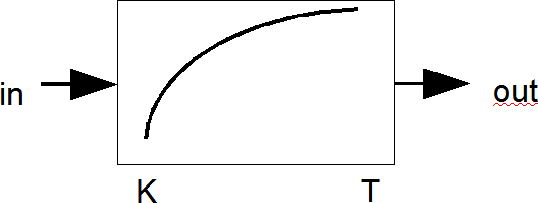
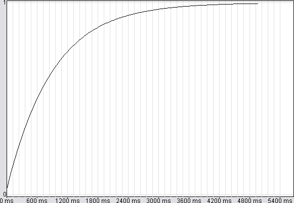

<!--
  Copyright (c) 2026 Hans Mühlbauer, Franz Höpfinger and others.

  This program and the accompanying materials are made available under the
  terms of the Eclipse Public License 2.0 which is available at
  https://www.eclipse.org/legal/epl-2.0

  SPDX-License-Identifier: EPL-2.0
-->

## Type	Funktionsbaustein

| | |
|:---|:---|
| **Input	IN** | REAL (Eingangssignal) |
| **T** | TIME (Zeitkonstante) |
| **K** | REAL (Multiplikator) |
| **Output	OUT** | REAL (Ausgangssignal) |
| | FT_PT1 ist ein LZI-Übertragungsglied mit einem proportionalen Übertragungsverhalten 1. Ordnung, auch als Tiefpass Filter 1. Ordnung bezeichnet. Der Multiplikator K legt den Verstärkungsfaktor ( Multiplikator) fest und T die Zeitkonstante. Eine Änderung am Eingang wird am Ausgang gedämpft sichtbar. Das Ausgangssignal steigt innerhalb von T auf 63% des Eingangswerts und  nach 3 * T auf 95% des Eingangswerts an. Somit ist nach einer sprunghaften Änderung des Eingangssignals von 0 auf 10 der Ausgang zum Zeitpunkt der Eingangsänderung 0, steigt nach 1 * T auf 6,3 an und erreicht nach 3 * T 9,5 und nähert sich dann asymptotisch dem Wert 10 an. Beim ersten Aufruf wird der Ausgang OUT mit dem Eingangswert IN initialisiert um ein definiertes Anlauf Verhalten zu gewährleisten. Falls der Eingang T gleich T#0s ist entspricht der Ausgang OUT = K * IN. |

| **Strukturbild** |  |
| | Sprungantwort für T=1s, K=1 |

