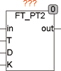
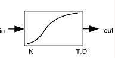

<!--
  Copyright (c) 2026 Hans Mühlbauer, Franz Höpfinger and others.

  This program and the accompanying materials are made available under the
  terms of the Eclipse Public License 2.0 which is available at
  https://www.eclipse.org/legal/epl-2.0

  SPDX-License-Identifier: EPL-2.0
-->

## Type	Funktionsbaustein

| | |
|:---|:---|
| **Input	IN** | REAL (Eingangssignal) |
| **T** | REAL (Zeitkonstante) |
| **D** | REAL (Dämpfung) |
| **K** | REAL (Multiplikator) |
| **Output	OUT** | REAL (Ausgangssignal) |
| | FT_PT2 ist ein LZI-Übertragungsglied mit einem proportionalen Übertragungsverhalten 2. Ordnung, auch als Tiefpass Filter 2. Ordnung bekannt. Der Multiplikator K legt den Verstärkungsfaktor ( Multiplikator) fest, T und D die Zeitkonstante und die Dämpfung. Falls der Eingang T gleich T#0s ist entspricht der Ausgang OUT = K * IN. |
| **Die entsprechende Funktionalbeziehung in Zeitbereich ist folgende Differenzialgleichung gegeben** |  |
| | T² * OUT''(T) + 2 * D* T * OUT'(T) + OUT(T) = K * in(T). |
| **Strukturbild** |  |
| | Sprungantwort für T=1, K=2, D=0,2 / 1 / 5 |

