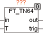

<!--
  Copyright (c) 2026 Hans Mühlbauer, Franz Höpfinger and others.

  This program and the accompanying materials are made available under the
  terms of the Eclipse Public License 2.0 which is available at
  https://www.eclipse.org/legal/epl-2.0

  SPDX-License-Identifier: EPL-2.0
-->

## Type	Funktionsbaustein

| | |
|:---|:---|
| **Input	IN** | REAL (Eingangssignal) |
| **T** | REAL (Verzögerungszeit) |
| **Output	OUT** | REAL (Ausgangssignal) |
| | FT_TN64 verzögert ein Eingangssignal um eine einstellbare Zeit T und tastet es in der Zeit T 64 mal ab. Nach jedem update des Ausgangssignals OUT wird TRIG für einen Zyklus TRUE. |
| | T64INOUT6362012 |

