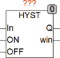
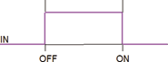

<!--
  Copyright (c) 2026 Hans Mühlbauer, Franz Höpfinger and others.

  This program and the accompanying materials are made available under the
  terms of the Eclipse Public License 2.0 which is available at
  https://www.eclipse.org/legal/epl-2.0

  SPDX-License-Identifier: EPL-2.0
-->

## Type	Funktionsbaustein

| | |
|:---|:---|
| **Input	IN** | REAL (Eingangswert) |
| **ON** | REAL (oberer Schwellenwert) |
| **OFF** | REAL (unterer Schwellenwert) |
| **Output	Q** | BOOL (Ausgangssignal) |
| **WIN** | BOOL (zeigt an, dass In zwischen ON und OFF liegt) |
| | HYST ist ein Standard Hysteresebaustein, Seine Funktion hängt von den Eingangswerten ON und OFF ab. |
| | Ist ON > OFF so wird der Ausgang TRUE gesetzt wenn IN > ON und er wird FALSE gesetzt wenn IN < OFF. |
| | Ist ON < OFF so wird der Ausgang TRUE gesetzt wenn IN < ON und er wird FALSE gesetzt wenn IN > OFF. |
| | Der Ausgang WIN wird TRUE wenn IN zwischen ON und OFF liegt, liegt IN außerhalb des Bereichs ON – OFF wird WIN FALSE. |

