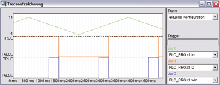

<!--
  Copyright (c) 2026 Hans Mühlbauer, Franz Höpfinger and others.

  This program and the accompanying materials are made available under the
  terms of the Eclipse Public License 2.0 which is available at
  https://www.eclipse.org/legal/epl-2.0

  SPDX-License-Identifier: EPL-2.0
-->

## Type	Funktionsbaustein

| | |
|:---|:---|
| **Input	IN** | REAL (Eingangswert) |
| **HIGH** | REAL (oberer Schwellenwert) |
| **LOW** | REAL (unterer Schwellenwert) |
| **Output	Q** | BOOL (Ausgangssignal) |
| **WIN** | BOOL (zeigt an, dass In zwischen LOW und HIGH liegt) |
| | HYST_1 ist ein Hysterese Baustein der mit oberen und unterem Limit arbeitet. Der Ausgang Q wird nur dann TRUE, wenn das Eingangssignal an IN den Wert HIGH überschritten hat. Es bleibt dann solange TRUE, bis das Eingangssignal wieder LOW unterschreitet und Q FALSE wird. Ein weiterer Ausgang WIN zeigt an, ob sich das Eingangssignal zwischen LOW und HIGH befindet. |
| | Das folgende Beispiel zeigt eine Dreiecksgenerator mit nachgeschalteten Hysterese Baustein HYST_1. |
| | Die grüne Kurve zeigt das Eingangssignal, Rot den Hysterese Ausgang und Blau den WIN Ausgang. |

