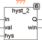
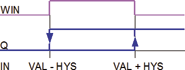

<!--
  Copyright (c) 2026 Hans Mühlbauer, Franz Höpfinger and others.

  This program and the accompanying materials are made available under the
  terms of the Eclipse Public License 2.0 which is available at
  https://www.eclipse.org/legal/epl-2.0

  SPDX-License-Identifier: EPL-2.0
-->

## Type	Funktionsbaustein

| | |
|:---|:---|
| **Input	IN** | REAL (Eingangswert) |
| **VAL** | REAL (Mittelwert der Hysterese) |
| **HYS** | REAL (Breite der Hysterese) |
| **Output	Q** | BOOL (Ausgangssignal) |
| **WIN** | BOOL (zeigt an das In zwischen LOW und HIGH liegt) |
| | HYST_2 ist ein Hysterese Baustein bei dem Die Schaltschwellen durch einen Mittelwert und die zugehörige Hysterese definiert wird. Die untere Schaltschwelle liegt bei VAL – HYS / 2 und die obere Schaltschwelle bei VAL + HYS / 2. |
| | Eine eingehende Beschreibung der Hysteresefunktion und ein Anwendungsbeispiel finden Sie unter HYST_1. |

