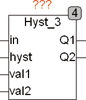
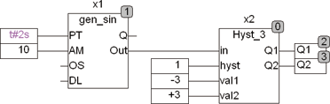
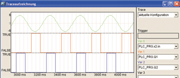

<!--
  Copyright (c) 2026 Hans Mühlbauer, Franz Höpfinger and others.

  This program and the accompanying materials are made available under the
  terms of the Eclipse Public License 2.0 which is available at
  https://www.eclipse.org/legal/epl-2.0

  SPDX-License-Identifier: EPL-2.0
-->

## Type	Funktionsbaustein

| | |
|:---|:---|
| **Input	IN** | REAL (Eingangswert) |
| **HYST** | REAL (Breite der Hysterese) |
| **VAL1** | REAL (Mittelwert der Hysterese 1) |
| **VAL2** | REAL (Mittelwert der Hysterese 2) |
| **Output	Q1** | BOOL (Ausgangssignal 1) |
| **Q2** | BOOL (Ausgangssignal 2) |
| | HYST_3 ist ein Dreipunktregler. Der Dreipunktregler besteht aus 2 Hysteresefunktionen. Q1 ist eine Hysterese mit val1 als Schwellenwert und HYST als Hysterese. Q1 wird TRUE, wenn IN kleiner ist als VAL1 – HYST / 2 und  wird FALSE, wenn IN größer ist als VAL1 + HYST /  2. Q2 funktioniert analog mit Val2. Der Dreipunktregler wird vor allen dann eingesetzt, wenn man motorische Klappen steuert, die dann mit Q1 auf und mit Q2 ab gesteuert werden. Ist der Wert von IN zwischen VAL1 und VAL2 bleiben beide Ausgänge FALSE und der Motor bleibt stehen. |
| **Folgendes Beispiel zeigt den Signalverlauf an einem 3-Punkt Regler** |  |

