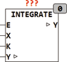

<!--
  Copyright (c) 2026 Hans Mühlbauer, Franz Höpfinger and others.

  This program and the accompanying materials are made available under the
  terms of the Eclipse Public License 2.0 which is available at
  https://www.eclipse.org/legal/epl-2.0

  SPDX-License-Identifier: EPL-2.0
-->

## Type	Funktionsbaustein

| | |
|:---|:---|
| **Input	E** | BOOL (Enable Eingang, Default = TRUE) |
| **X** | REAL (Eingangswert) |
| **K** | REAL (Integrationsbeiwert in 1/s) |
| **I/O	Y** | REAL (Integrator Ausgang) |
| | INTEGRATE ist ein Integrator der den Wert X auf einen externen Wert Y auf integriert. Der Integrator arbeitet wenn E = TRUE, der interne Default von E = TRUE. |

