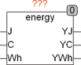

<!--
  Copyright (c) 2026 Hans Mühlbauer, Franz Höpfinger and others.

  This program and the accompanying materials are made available under the
  terms of the Eclipse Public License 2.0 which is available at
  https://www.eclipse.org/legal/epl-2.0

  SPDX-License-Identifier: EPL-2.0
-->

## Type	Funktionsbaustein

| | |
|:---|:---|
| **Input	J** | REAL (Joule) |
| **C** | REAL (Kalorie) |
| **WH** | REAL (Wattstunden) |
| **Output	YJ** | REAL (Joule) |
| **YC** | REAL (Kalorie) |
| **YWH** | REAL (Wattstunden) |
| | Der Baustein ENERGY konvertiert verschiedene in der Praxis gebräuchliche Einheiten für Energie. Normalerweise wird nur der zu konvertierende Eingang belegt und die restlichen Eingänge bleiben frei. Werden jedoch mehrere Eingänge gleichzeitig mit Werten beaufschlagt, so werden die Werte aller Eingänge entsprechend umgewandelt und dann aufsummiert. |
| | 1 J = 1 Ws (Watt * Sekunden) = 1 Nm (Newton * Meter) |
| | 1 C = 4,1868 J = 1,163 * 10-3 Wh (Watt * Stunden) |
| | 1 Wh = 3,6 * 103 J = 860 C |

