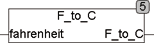

<!--
  Copyright (c) 2026 Hans Mühlbauer, Franz Höpfinger and others.

  This program and the accompanying materials are made available under the
  terms of the Eclipse Public License 2.0 which is available at
  https://www.eclipse.org/legal/epl-2.0

  SPDX-License-Identifier: EPL-2.0
-->

## F_TO_C

| | |
|:---|:---|
| **Type	Funktion** | REAL |
| **Input	FAHRENHEIT** | REAL (Temperaturwert in Fahrenheit) |
| **Output** | REAL (Temperaturwert in °C) |
| | F_TO_C rechnet einen Temperaturwert von Fahrenheit in °C um. |

