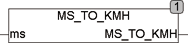

<!--
  Copyright (c) 2026 Hans Mühlbauer, Franz Höpfinger and others.

  This program and the accompanying materials are made available under the
  terms of the Eclipse Public License 2.0 which is available at
  https://www.eclipse.org/legal/epl-2.0

  SPDX-License-Identifier: EPL-2.0
-->

## MS_TO_KMH

| | |
|:---|:---|
| **Type	Funktion** | REAL |
| **Input	MS** | REAL (Geschwindigkeit in km/h) |
| **Output** | REAL (Geschwindigkeit in m/s) |
| | MS_TO_KMH rechnet einem Geschwindigkeitswert von Meter / Sekunde in Kilometer / Stunde um. |
| **MS_TO_KMH** | = MS * 3.6 |

