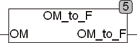

<!--
  Copyright (c) 2026 Hans Mühlbauer, Franz Höpfinger and others.

  This program and the accompanying materials are made available under the
  terms of the Eclipse Public License 2.0 which is available at
  https://www.eclipse.org/legal/epl-2.0

  SPDX-License-Identifier: EPL-2.0
-->

## OM_TO_F

| | |
|:---|:---|
| **Type	Funktion** | REAL |
| **Input	OM** | REAL (Kreisfrequenz Omega) |
| **Output** | REAL (Frequenz in Hz) |
| | OM_TO_F berechnet die Frequenz in Hz aus der Kreisfrequenz Omega. |

