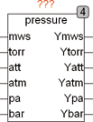

<!--
  Copyright (c) 2026 Hans Mühlbauer, Franz Höpfinger and others.

  This program and the accompanying materials are made available under the
  terms of the Eclipse Public License 2.0 which is available at
  https://www.eclipse.org/legal/epl-2.0

  SPDX-License-Identifier: EPL-2.0
-->

## PRESSURE

| | |
|:---|:---|
| **Type** | Funktionsbaustein |
| **Input	MWS** | REAL (Wassersäule in Meter) |
| **TORR** | REAL (Torr Bzw. Quecksilbersäule in mm) |
| **ATT** | REAL (Atmosphäre technisch) |
| **ATM** | REAL (Atmosphäre physikalisch) |
| **PA** | REAL (Pascal) |
| **BAR** | REAL (Bar) |
| **Output	YMWS** | REAL (Wassersäule in Meter) |
| **YTORR** | REAL (Torr Bzw. Quecksilbersäule in mm) |
| **YATT** | REAL (Atmosphäre technisch) |
| **YATM** | REAL (Atmosphäre physikalisch) |
| **YPA** | REAL (Pascal) |
| **YBAR** | REAL (Bar) |
| | Der Baustein PRESSURE konvertiert verschiedene in der Praxis gebräuchliche Einheiten für Druck. Normalerweise wird nur der zu konvertierende Eingang belegt und die restlichen Eingänge bleiben frei. Werden jedoch mehrere Eingänge gleichzeitig mit Werten beaufschlagt, so werden die Werte aller Eingänge entsprechend umgewandelt und dann aufsummiert. |
| | 1 MWS = 1 Meter Wassersäule = 0,0980665 Bar |
| | 1 TORR = 1 mm Quecksilbersäule = 0,133322 Bar = 101325 / 760 Pa |
| | 1 ATT = 1 kp / cm² = 0,980665 Bar |
| | 1 ATM = 1,01325 Bar |
| | 1 PA = 1 N / m² |
| | 1 BAR = 105 Pa |

