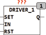

<!--
  Copyright (c) 2026 Hans Mühlbauer, Franz Höpfinger and others.

  This program and the accompanying materials are made available under the
  terms of the Eclipse Public License 2.0 which is available at
  https://www.eclipse.org/legal/epl-2.0

  SPDX-License-Identifier: EPL-2.0
-->

## Type	Funktionsbaustein

| | |
|:---|:---|
| **Input	SET** | BOOL (asynchroner Set Eingang) |
| **IN** | BOOL (Schalteingang) |
| **RST** | BOOL (asynchroner Reset Eingang) |
| **Output	Q0** | BOOL (Schaltausgang) |
| | DRIVER_1 ist ein Treiberbaustein dessen Ausgang Q durch den Eingang IN wenn TOGGLE_MODE = FALSE gesetzt werden kann. Der Ausgang bleibt dann solange auf TRUE bis er entweder durch einen asynchronen Reset (RST) auf FALSE gesetzt wird oder bis die maximale Schaltzeit (TIMEOUT) abgelaufen ist. Weitere Impulse  am Eingang IN verlängern dabei die TRUE Phase am Ausgang indem mit jeder steigenden Flanke an IN der Timeout von Neuem beginnt. Wenn TOGGLE_MODE = TRUE, dann schaltet der Ausgang Q mit jeder steigenden Flanke an IN den Zustand zwischen TRUE und FALSE. Auch im TOGGLE_MODE wird mit TIMEOUT die maximale TRUE Phase am Ausgang Q begrenzt. Wird TIMEOUT auf T#0s gesetzt (Default) dann ist kein Timeout aktiv. Die asynchronen SET und RST Eingänge setzten den Ausgang Q auf TRUE oder FALSE. Der Baustein DRIVER_4 stellt bei gleicher Funktionalität 4 Schaltausgänge zur Verfügung. |
| **Setup	TOGGLE_MODE** | BOOL (Mode des Eingangs IN) |
| **TIMEOUT** | TIME (Maximale Einschaltdauer der Ausgänge) |

