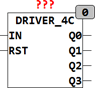

<!--
  Copyright (c) 2026 Hans Mühlbauer, Franz Höpfinger and others.

  This program and the accompanying materials are made available under the
  terms of the Eclipse Public License 2.0 which is available at
  https://www.eclipse.org/legal/epl-2.0

  SPDX-License-Identifier: EPL-2.0
-->

## Type	Funktionsbaustein

| | |
|:---|:---|
| **Input	IN** | BOOL (Schalteingang) |
| **RST** | BOOL (asynchroner Reset Eingang) |
| **Output	Q0 .. Q3** | BOOL (Schaltausgänge) |
| | DRIVER_4C ist ein Treiberbaustein dessen Ausgangszustände mit einer steigenden Flanke an IN geschaltet werden. Die Ausgangszustände sind im Setup Array SX vordefiniert und können vom Anwender jederzeit geändert werden. Im Array SX[1..6] sind die Ausgangszustände für jeden Schaltzustand SN einzeln Bitweise definiert. Bit 0 eines Elements schaltet Q0, Bit1 schaltet Q1, Bit2 Q2 und Bit3 Q3, die oberen 4 Bits werden jeweils ignoriert. Das Array ist Vorbelegt mit Bit0 = TRUE für SN = 1, Bit1 für SN = 2. Bit2 für SN = 3 und Bit3 für SN = 4. Somit wird am Ausgang die Sequenz (0000,0001,0010,0100,1000,0000) für (Q3,Q2,Q1,Q0) durchlaufen. Ist das Element SX[SN] des Arrays 0 so springt SN automatisch auf 0 zurück, so dass ein leeres Element die Sequenz abbricht. Bei Ablauf des Timeout springt der Baustein automatisch in den Zustand SN = 0 zurück. Der Timeout ist nur dann aktiv wenn die Variable TIMEOUT > t#0s ist. |
| **Setup	TIMEOUT** | TIME (Maximale Einschaltzeit des Bausteins) |
| **SX** | ARRAY[1..7] OF BYTE := 1,2,4,8,0,0,0; |
| | (Voreinstellung der Schaltsequenz) |



**Beispiel:**

```iecst
SX = 1,3,7,15,7,3,1 erzeugt folgende Sequenz: Q3,Q2,Q1,Q0 = 0000,0001,0011,0111,1111,0111,0011,0001,0000,......
```
