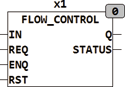
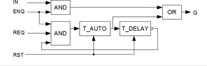

<!--
  Copyright (c) 2026 Hans Mühlbauer, Franz Höpfinger and others.

  This program and the accompanying materials are made available under the
  terms of the Eclipse Public License 2.0 which is available at
  https://www.eclipse.org/legal/epl-2.0

  SPDX-License-Identifier: EPL-2.0
-->

## Type	Funktionsbaustein

| | |
|:---|:---|
| **Input	IN** | BOOL (Steuereingang) |
| **REQ** | BOOL (Request für Automatikmodus) |
| **ENQ** | BOOL (Enable für Ausgang Q) |
| **RST** | BOOL (asynchroner Reset Eingang) |
| **Output	Q** | BOOL (Schaltausgang für Ventil) |
| **STATUS** | BYTE (ESR kompatibler Statusausgang) |
| | FLOW_CONTROL Schaltet ein Ventil am Ausgang Q wenn der Eingang IN = TRUE. Zusätzlich kann das Ventil auch über den Eingang REQ geschaltet werden, Wenn REQ = TRUE schaltet das Ventil für die Zeit T_AUTO ein und wird dann für die Zeit T_DELAY gesperrt. nach Ablauf der Zeit T_DELAY kann über REQ das Ventil wieder Eingeschaltet werden. Während der Sperrzeit T_DELAY kann das Ventil jedoch über den Eingang IN gesteuert werden. Ein ESR kompatibler Status Ausgang STATUS signalisiert den Zustand des Bausteins. Sowohl REQ als auch IN können den Ausgang Q nur dann schalten wenn der Eingang ENQ auf TRUE steht. |
| **Status = 100** | Betriebsbereit |
| **Status = 101** | Ventil ein durch TRUE an IN |
| **Status = 102** | Ventil ein durch TRUE an REQ |
| **Status = 103** | Reset wurde ausgeführt |
| **Das folgernde Schema verdeutlicht den Aufbau von FLOW_CONTROL** |  |
| **Setup	T_AUTO** | TIME (Ventil Einschaltzeit im Automatikmodus) |
| **T_DELAY** | TIME(Ventil Disable Zeit im Automatikmodus) |

