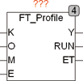
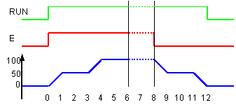

<!--
  Copyright (c) 2026 Hans Mühlbauer, Franz Höpfinger and others.

  This program and the accompanying materials are made available under the
  terms of the Eclipse Public License 2.0 which is available at
  https://www.eclipse.org/legal/epl-2.0

  SPDX-License-Identifier: EPL-2.0
-->

## Type	Funktionsbaustein

| | |
|:---|:---|
| **Input	K** | REAL (Multiplikator) |
| **O** | REAL (Offset) |
| **M** | REAL (Zeitmultiplikator) |
| **E** | BOOL (Startsignal) |
| **Output	Y** | REAL (Signalausgang) |
| **RUN** | BOOL (TRUE, wenn Ausgangssignal erzeugt wird) |
| **ET** | TIME (Zeit seit Start des Ausgangsprofils) |
| **Setup	VALUE_0** | REAL (Ausgangswert des Ausgangs zum Start) |
| **TIME_1** | TIME (Zeitpunkt wenn die Rampe VALUE_1 erreicht) |
| **VALUE_1** | REAL (Wert der Rampe zum Zeitpunkt TIME_1) |
| **TIME_2** | TIME (Zeitpunkt wenn die Rampe VALUE_2 erreicht) |
| **VALUE_2** | REAL (Wert der Rampe zum Zeitpunkt TIME_2) |
| **TIME_3** | TIME (Zeitpunkt wenn die Rampe VALUE_3 erreicht) |
| **VALUE_3** | REAL (Wert der Rampe zum Zeitpunkt TIME_3) |
| **TIME_10** | TIME (Zeitpunkt wenn die Rampe VALUE_10 erreicht) |
| **VALUE_10** | REAL (Wert der Rampe zum Zeitpunkt TIME_10) |
| **TIME_11** | TIME (Zeitpunkt wenn die Rampe VALUE_11 erreicht) |
| **VALUE_11** | REAL (Wert der Rampe zum Zeitpunkt TIME_11) |
| **TIME_12** | TIME (Zeitpunkt wenn die Rampe VALUE_12 erreicht) |
| **VALUE_12** | REAL (Wert der Rampe zum Zeitpunkt TIME_12) |
| **TIME_13** | TIME (Zeitpunkt wenn die Rampe VALUE_13 erreicht) |
| **VALUE_13** | REAL (Wert der Rampe zum Zeitpunkt TIME_13) |
| | FT_PROFILE erzeugt ein zeitabhängiges Ausgangssignal. Das Ausgangssignal wird definiert durch Zeit – Wertepaare. FT_PROFILE erzeugt ein Ausgangssignal Y, indem die Wertepaare durch Rampen verbunden werden. Ein typische Anwendung für FT_PROFILE ist die Erzeugung eines Temperaturprofils für einen Glühofen, aber auch jede Anwendung die ein zeitabhängiges Steuersignal benötigt stellt ein Anwendungsgebiet dar. Das zeitabhängige Ausgangssignal wird durch eine steigende Flanke an E gestartet und läuft dann selbsttätig ab. Nach dem Wertepaar (TIME_10, VALUE_10) verharrt das Ausgangssignal auf VALUE_10, bis der Eingang E FALSE wird. Mit einer Flanke an E kann also das Signal gestartet werden und zusätzlich kann der Eingang E auch benutzt werden um das Signal beliebig lange zu strecken. Dadurch ist es möglich einen Verlauf bis zum Wert VALUE_3 zu erzeugen, mit E zu strecken und nach der fallenden Flanke von E wieder einen Verlauf zurück zum Ausgangswert zu erzeugen. Mit den Eingängen K, O und M kann das Ausgangssignal dynamisch gestreckt und skaliert werden. |
| | Y = erzeugter Wert * K + O |
| | Der Eingang M dient zum Strecken des Signals über die Zeit. Der tatsächliche Zeitverlauf entspricht dem über Setup definierten Zeitverlauf multipliziert mit M. Um geradlinige Rampen zu gewährleisten wirkt eine Zeitstreckung durch M nur nach Abschluss einer Flanke. Der Ausgang RUN wird mit einer steigenden Flanke von E auf TRUE gesetzt und wird erst nach Abschluss des Zeitprofils wieder FALSE. Am Ausgang ET kann die seit Start verstrichene Zeit abgelesen werden. |
| **Die folgenden Graphiken zeigen das Ausgangssignal für die Wertepaare** |  |
| | VALUE_0 = 0 |
| | TIME_1, VALUE_1 = 1s, 50 |
| | TIME_2, VALUE_2 = 3s, 50 |
| | TIME_3, VALUE_3 = 4s, 100 |
| | TIME_10, VALUE_10 = 6s, 100 |
| | TIME_11, VALUE_11 = 7s, 50 |
| | TIME_12, VALUE_12 = 9s, 50 |
| | TIME_13, VALUE_13 = 10s, 0 |
| | Die Schaubilder stellen das Ausgangssignal sowohl mit gestreckter Phase 3 durch E dar, als auch ohne Streckung. |

