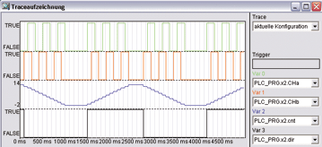

<!--
  Copyright (c) 2026 Hans Mühlbauer, Franz Höpfinger and others.

  This program and the accompanying materials are made available under the
  terms of the Eclipse Public License 2.0 which is available at
  https://www.eclipse.org/legal/epl-2.0

  SPDX-License-Identifier: EPL-2.0
-->

## Type	Funktionsbaustein

| | |
|:---|:---|
| **Input	CHA** | BOOL (Kanal A des Gebers) |
| **CHB** | BOOL (Kanal B des Gebers) |
| **RST** | BOOL (Reset) |
| **Output	DIR** | BOOL (Drehrichtung) |
| **CNT** | INT (Zählerwert) |
| | INC_DEC ist ein Decoder für Inkrementalgeber. Inkrementalgeber (Drehgeber) liefern 2 überlappende Impulse, Kanal A und Kanal B. Aus den beiden Kanälen wird die Drehrichtung und der Drehwinkel dekodiert. INC_DEC detektiert jede einzelne Flanke des Drehgebers, sodass 4-fache Auflösung erreicht wird. Der Ausgang DIR zeigt die Drehrichtung an, und am Ausgang CNT steht ein Integer-Wert bereit, der die Anzahl der gezählten Impulse ausgibt. Für eine volle Umdrehung eines Drehgebers mit 100 Impulsen zählt CNT bis 400, weil an jeder Flanke beider Kanäle gezählt wird, sodass 4-fache Auflösung erreicht wird. Ein RST Eingang erlaubt jederzeit den Zähler auf 0 zu stellen. Der Zähler zählt aufwärts, wenn DIR = TRUE und abwärts, wenn DIR = FALSE. |
| | Im Folgenden Beispiel wird ein Bitmustergenerator GEN_BIT benutzt um einen Drehgeber zu simulieren, der immer abwechselnd 3 Schritte im Uhrzeigersinn und 3 im Gegenuhrzeigersinn macht. In der Traceaufzeichnung ist zu sehen, wie der INC_DEC die Bewegung in 12 Zahlschritte zerlegt und die Richtung dekodiert. |

