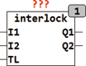
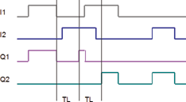

<!--
  Copyright (c) 2026 Hans Mühlbauer, Franz Höpfinger and others.

  This program and the accompanying materials are made available under the
  terms of the Eclipse Public License 2.0 which is available at
  https://www.eclipse.org/legal/epl-2.0

  SPDX-License-Identifier: EPL-2.0
-->

## Type	Funktionsbaustein

| | |
|:---|:---|
| **Input	I1** | BOOL (Eingang 1) |
| **I2** | BOOL (Eingang 2) |
| **TL** | TIME (Totzeit) |
| **Output	Q1** | BOOL (Ausgang 1) |
| **Q2** | BOOL (Ausgang 2) |
| | Der Baustein INTERLOCK hat 2 Eingänge I1 und I2 die jeweils die Ausgänge Q1 und Q2 schalten. Q1 und Q2 sind jedoch gegenseitig verriegelt so dass immer nur ein Ausgang auf TRUE stehen kann. Die Zeit TL legt eine Totzeit zwischen den Beiden Ausgängen fest. Ein Ausgang kann nur dann TRUE werden wenn der andere Ausgang für mindestens für die Zeit TL FALSE war. |

| I1 | I2 | Q1 | Q2 |
| --- | --- | --- | --- |
| 0 | 0 | 0 | 0 |
| 0 | 1 | 0 | 1 |
| 1 | 0 | 1 | 0 |
| 1 | 1 | 0 | 0 |
