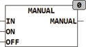
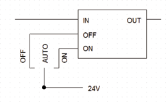

<!--
  Copyright (c) 2026 Hans Mühlbauer, Franz Höpfinger and others.

  This program and the accompanying materials are made available under the
  terms of the Eclipse Public License 2.0 which is available at
  https://www.eclipse.org/legal/epl-2.0

  SPDX-License-Identifier: EPL-2.0
-->

## MANUAL

| | |
|:---|:---|
| **Type	Funktion** | BOOL |
| **Input	IN** | BOOL (Eingangssignal) |
| **ON** | BOOL (Handbetrieb Ein) |
| **OFF** | BOOL (Handbetrieb Aus) |
| **Output** | BOOL (Ausgangssignal) |
| | MANUAL kann ein Eingangssignal IN mit TRUE oder mit FALSE überschreiben. |
| | Die typische Verwendung von MANUAL ist mittels eines Schalters mit 3 Stellungen (AUS, AUTO, EIN) wobei die Anschlüsse AUS auf OFF und EIN auf ON geschaltet werden und AUTO des Schalters offen bleibt. |
| **Das folgende Schema zeigt die mögliche Anschaltung eines Schalters mit 3 Stellungen** |  |

| IN | ON | OFF | Q |  |
| --- | --- | --- | --- | --- |
| 0 | 0 | 0 | 0 |  |
| 1 | 0 | 0 | 1 |  |
| - | - | 1 | 0 | Handbetrieb Stellung AUS |
| - | 1 | 0 | 1 | Handbetrieb Stellung EIN |
