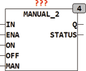

<!--
  Copyright (c) 2026 Hans Mühlbauer, Franz Höpfinger and others.

  This program and the accompanying materials are made available under the
  terms of the Eclipse Public License 2.0 which is available at
  https://www.eclipse.org/legal/epl-2.0

  SPDX-License-Identifier: EPL-2.0
-->

## MANUAL_2

| | |
|:---|:---|
| **Type** | Funktionsbaustein |
| **Input	IN** | BOOL (Eingangssignal) |
| **ENA** | BOOL (Baustein Enable Eingang) |
| **ON** | BOOL (Zwingt den Ausgang auf TRUE) |
| **OFF** | BOOL (Zwingt den Ausgang auf FALSE) |
| **MAN** | BOOL (Ausgangszustand bei Manualbetrieb) |
| **Output	Q** | BOOL (Ausgangssignal) |
| **STATUS** | BYTE (ESR kompatibler Status Ausgang) |
| | MANUAL_2  kann ein digitales Signal überschreiben und schaltet zwischen Hand und Automatikbetrieb um. der Baustein ist so ausgelegt das ein 3-stufiger Schalter zwischen Aus, Automatik und Ein schaltet. Das Signal im Automatikzustand wird auf IN gelegt, im Falle von erzwungenem Aus wird OFF auf TRUE gelegt und im Falle von erzwungenem Ein wird ON auf TRUE gelegt. die Beiden Eingänge ON und OFF auf FALSE schalten den Eingang IN direkt auf den Ausgang Q. werden jedoch beide Eingänge ON und OFF gleichzeitig auf TRUE gesetzt, so wird der Zustand des Eingangs MAN auf den Ausgang geschaltet. Der Eingang MAN kann auch dazu benutzt werden um einen Vorrang für ON oder OFF zu definieren, den der Wert von MAN wird immer dann auf den Ausgang gelegt wenn beide Eingänge ON und OFF gleichzeitig auf TRUE stehen. Ist der Eingang ENA auf FALSE so bleibt der Ausgang immer auf FALSE, der Baustein ist disabled. Die folgende Tabelle definiert die Betriebszustände des Bausteins. Der Ausgang STATUS ist ESR kompatibel und meldet die Zustände des Bausteins an entsprechende ESR Bausteine weiter. |

| IN | ENA | ON | OFF | MAN | Q | STATUS |  |
| --- | --- | --- | --- | --- | --- | --- | --- |
| - | L | - | - | - | L | 104 | Disabled |
| X | H | L | L | - | X | 100 | Auto Mode |
| - | H | H | L | - | H | 101 | forceHigh |
| - | H | L | H | - | L | 102 | forceLow |
| - | H | H | H | X | X | 103 | Manual Input |
| - | H | H | H | L | L | 103 | ForcewithPriorityfor OFF |
| - | H | H | H | H | H | 103 | ForcewithPriorityfor ON |
