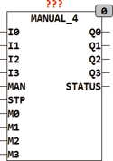

<!--
  Copyright (c) 2026 Hans Mühlbauer, Franz Höpfinger and others.

  This program and the accompanying materials are made available under the
  terms of the Eclipse Public License 2.0 which is available at
  https://www.eclipse.org/legal/epl-2.0

  SPDX-License-Identifier: EPL-2.0
-->

## MANUAL_4

| | |
|:---|:---|
| **Type** | Funktionsbaustein |
| **Input	I0..I3** | BOOL (Eingangssignale) |
| **MAN** | BOOL (Umschaltung auf Handbetrieb) |
| **M0..M3** | BOOL (Eingangssignale bei Handbetrieb) |
| **STP** | BOOL (Asynchroner Step bei Handbetrieb) |
| **Output	Q0..Q3** | BOOL (Ausgangssignale) |
| **STATUS** | BYTE (ESR kompatibler Status Ausgang) |
| | MANUAL_4 kann 4 digitale Signal im Handbetrieb überschreiben. Solange MAN = FALSE folgen die Ausgänge Q direkt den Eingängen I. Sobald MAN = TRUE wird folgen die Ausgänge den Zuständen der Eingänge M. Mit dem Eingang STP  kann im Handbetrieb ein rotierendes Setzen der Ausgänge erzeugt werden. STP ist nur während des Handbetriebs aktiv. Wird im Handbetrieb an STP eine steigende Flanke registriert, so folgen die Ausgänge nicht mehr den Eingängen MX sondern werden mit STP zyklisch durchgeschaltet. Bei der ersten steigenden Flanke an STP wird nur der Ausgang Q0 aktiv und bei der nächsten Flanke an STP schaltet der Baustein auf den Ausgang Q1 und so weiter. Sobald der Eingang MAN wieder auf FALSE geht, folgen die Ausgänge Q wieder den Eingängen I. Der ESR kompatible Status Ausgang meldet Schaltzustände weiter. |

| STATUS | Zustand |
| --- | --- |
| 100 | Automatic Mode MAN = FALSE, Q0 = I0, Q1 = I1, Q2 = I2, Q3 = I3 |
| 101 | Manual Mode MAN = TRUE, Q0 = M0, Q1 = M1, Q2 = M2, Q3 = M3 |
| 110,111,112,113 | Step Mode for Output Q0, Q1, Q2, Q3 |
