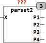

<!--
  Copyright (c) 2026 Hans Mühlbauer, Franz Höpfinger and others.

  This program and the accompanying materials are made available under the
  terms of the Eclipse Public License 2.0 which is available at
  https://www.eclipse.org/legal/epl-2.0

  SPDX-License-Identifier: EPL-2.0
-->

## PARSET2

| | |
|:---|:---|
| **Type** | Funktionsbaustein |
| **Input	X** | REAL (Signaleingang) |
| **Output	P1** | REAL (Parameter 1 Ausgang) |
| **P2** | REAL (Parameter 2 Ausgang) |
| **P3** | REAL (Parameter 3 Ausgang) |
| **P4** | REAL (Parameter 4 Ausgang) |
| | PARSET2 wählt aus bis zu 4 Parametersätzen je einen aus und liefert die Werte an den Ausgängen P1 bis P4. Die Werte für die Parametersätze werden mit Setup Variablen definiert. Wird die Setup Variable TC auf einen Wert > 0 gesetzt, so schalten die Ausgänge nicht sprunghaft auf einen neuen Wert, sondern laufen in einer Rampe  auf den neuen Wert zu so dass der Endwert nach der Zeit TC erreicht wird. Dies erlaubt den weichen Übergang zwischen verschiedenen Parametersätzen. Die Auswahl der Parameter wird durch die Steuergröße X und die Schaltschwellen L1 bis L3 festgelegt. |
| **Setup	X01, X11, X21, X31** | REAL (Werte für Parameter P1) |
| **X02, X12, X22, X32** | REAL (Werte für Parameter P2) |
| **X03, X13, X23, X33** | REAL (Werte für Parameter P3) |
| **X04, X14, X24, X34** | REAL (Werte für Parameter P4) |
| **L1, L2, L3** | REAL (Limits für die Parameterumschaltung |
| **TC** | TIME (Rampenzeit an den Ausgängen P) |

| X | P1 | P2 | P3 | P4 |
| --- | --- | --- | --- | --- |
| X < L1 | X01 | X02 | X03 | X04 |
| L1 < X < L2 | X11 | X12 | X13 | X14 |
| L2 < X < L3 | X21 | X22 | X23 | X24 |
| X >= L3 | X31 | X32 | X33 | X34 |
