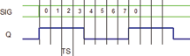

<!--
  Copyright (c) 2026 Hans Mühlbauer, Franz Höpfinger and others.

  This program and the accompanying materials are made available under the
  terms of the Eclipse Public License 2.0 which is available at
  https://www.eclipse.org/legal/epl-2.0

  SPDX-License-Identifier: EPL-2.0
-->

## Type	Funktionsbaustein

| | |
|:---|:---|
| **Input	IN** | BOOL (Freigabeeingang) |
| **SIG** | BYTE (Bitpattern) |
| **TS** | TIME (Schaltzeit) |
| **Output	Q** | BOOL (Ausgangssignal) |
| | SIGNAL erzeugt ein Ausgangssignal Q das dem Bitpattern in SIG entspricht. Das Bitpattern wird in TS langen Schritten Ausgegeben. Durch verschiedene Bitmuster in SIG können verschiedene Ausgangssignale erzeugt werden. Wird der Eingang IN auf TRUE geschaltet beginnt der Baustein den Ausgang Q entsprechend dem in SIG bereitgestellten Bitpattern  Einzuschalten. Durch die Anpassung des Bitpattern können verschiedene Ausgangssignale erzeugt werden. Ein Pattern von 10101010 erzeugt eine Ausgangssignal mit 50% DutyCycle und einer Frequenz die 1 / 2*S entspricht. Ein Pattern von 11110000 erzeugt hingegen ein Ausgangssignal von 50% DC und einer Frequenz von 1 / 8*TS. Der Start eines Ausgangssignals ist zufällig. Die Bitsequenz beginnt ab einem Beliebigen Bit sobald der Eingang IN auf TRUE geht. Wird am Eingang TS keine Zeit vorgegeben so verwendet der Baustein intern eine Vorgabe von 1024ms je Zyklus (ein Zyklus ist der Durchlauf aller 8 Bits einer Sequenz). Typische Anwendungen für SIGNAL ist die Signalerzeugung für Sirenen oder Signallampen. |
| | Die folgende Grafik verdeutlicht die Funktionsweise von SIGANL für |
| **SIG = 2#1111_0000** |  |

