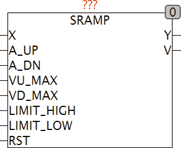
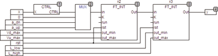
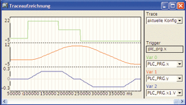

<!--
  Copyright (c) 2026 Hans Mühlbauer, Franz Höpfinger and others.

  This program and the accompanying materials are made available under the
  terms of the Eclipse Public License 2.0 which is available at
  https://www.eclipse.org/legal/epl-2.0

  SPDX-License-Identifier: EPL-2.0
-->

## SRAMP

| | |
|:---|:---|
| **Type** | Funktionsbaustein |
| **Input	X** | REAL (Eingangssignal) |
| **A_UP** | REAL (Maximale Beschleunigung Aufwärts) |
| **A_DN** | REAL (Maximale Beschleunigung Abwärts) |
| **VU_MAX** | REAL (Maximale Geschwindigkeit Aufwärts) |
| **VD_MAX** | REAL (Maximale Geschwindigkeit Abwärts) |
| **LIMIT_HIGH** | REAL (Ausgangslimit High) |
| **LIMIT_LOW** | REAL (Ausgangslimit Low) |
| **RST** | BOOL (Asynchroner Reset) |
| **Output	Y** | REAL (Ausgangssignal) |
| **V** | REAL (Momentane Geschwindigkeit des Ausgangssignals) |
| | SRAMP erzeugt ein Ausgangssignal das durch einstellbare Parameter begrenzt wird. Das Ausgangssignal folgt dem Eingangssignal und wird dabei durch maximale Geschwindigkeit (VU_MAX und VD_MAX), oberer und unterer Grenzwert (LIMIT_LOW und LIMIT_HIGH), sowie eine maximale Beschleunigung (A_UP und A_DN) begrenzt. SRAMP wird verwendet um zum Beispiel Motoren anzusteuern. Der Ausgang V gibt die momentane Geschwindigkeit des Ausgangs an. |
| | Im folgenden Schema ist die Interne Arbeitsweise von SRAMP ersichtlich. Ein Rampengenerator X2 stellt die Geschwindigkeit mit der sich der Ausgang verändern darf ein und ein Zweiter Rampengenerator X3 steuert den Ausgang. |
| | Die Trace Aufzeichnung zeigt ein Beispiel für SRAMP. Der Eingang (grün) steigt von 0 auf 20 und gleich danach auf 10 wobei der Ausgang mit der maximal zulässigen Beschleunigung auf die maximal zulässige Geschwindigkeit ansteigt, anschließend wird verdeutlicht das der Eingang auch während des Signalverlaufs sich ändern kann. In diesem Beispiel wird rechtzeitig wieder abgebremst, so das exakt bei 10 der Ausgang zum Stillstand kommt. Nach erreichen des Endwertes 10 schaltet der Eingang auf -3 und der Ausgang Y folgt entsprechend. |
| | Die Eingangswerte für A_UP und VU_MAX müssen mit positivem Vorzeichen angegeben werden,  A_DN und VD_MAX benötigen ein negatives Vorzeichen. |

