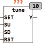

<!--
  Copyright (c) 2026 Hans Mühlbauer, Franz Höpfinger and others.

  This program and the accompanying materials are made available under the
  terms of the Eclipse Public License 2.0 which is available at
  https://www.eclipse.org/legal/epl-2.0

  SPDX-License-Identifier: EPL-2.0
-->

## Type	Funktionsbaustein

| | |
|:---|:---|
| **Input	SET** | BOOL (Asynchroner Set Eingang) |
| **SU, SD** | BOOL (Eingänge für Auf und Ab) |
| **RST** | BOOL (Asynchroner Reset Eingang) |
| **Output	Y** | REAL (Ausgangssignal) |
| | TUNE setzt mithilfe von Auf- und Ab- Tastern ein Ausgangssignal Y. Durch entsprechende Setup Variablen kann die Schrittweite individuell Programmiert werden. Ein oberer und unterer Grenzwert für den Ausgang Y kann  mittels LIMIT_L und LIMIT_H vorgegeben werden. mit den Tastern SU und SD werden Schritte Auf oder Ab erzeugt. Wird eine Taste länger als die Zeit T1 gedrückt gehalten, so wird der Ausgang Y kontinuierlich Auf oder Ab verstellt. Die Geschwindigkeit mit der der Ausgang verstellt wird ist hierbei mit S1 vorgegeben. S1 und S2 geben die Einheiten je Sekunde an. Wird  eine Taste länger als die Zeit T2 gedrückt gehalten, so schaltet der Baustein automatisch auf eine zweite Geschwindigkeit S2 um. Mit den Eingängen RST und SET kann der Ausgang jederzeit auf einen durch RST_VAL beziehungsweise SET_VAL vorgegebenen Wert gestellt werden. |
| **Setup	SS** | REAL (Schrittweite für kleiner Schritt) |
| **Limit_L** | REAL (unterer Grenzwert) |
| **Limit_H** | REAL (oberer Grenzwert) |
| **RST_VAL** | REAL ( Ausgangswert nach Reset) |
| **SET_VAL** | REAL (Ausgangswert nach SET) |
| **T1** | TIME (Zeit nach der die erste Rampe anläuft) |
| **T1** | TIME (Zeit nach der die zweite Rampe anläuft) |
| **S1** | REAL (Geschwindigkeit für erste Rampe) |
| **S2** | REAL (Geschwindigkeit für zweite Rampe) |

