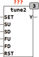

<!--
  Copyright (c) 2026 Hans Mühlbauer, Franz Höpfinger and others.

  This program and the accompanying materials are made available under the
  terms of the Eclipse Public License 2.0 which is available at
  https://www.eclipse.org/legal/epl-2.0

  SPDX-License-Identifier: EPL-2.0
-->

## Type	Funktionsbaustein

| | |
|:---|:---|
| **Input	SET** | BOOL (Asynchroner Set Eingang) |
| **SU, SD** | BOOL (Eingänge für Auf und Ab in kleinen Schritten) |
| **FU, FD** | BOOL (Eingänge für Auf und Ab in großen Schritten) |
| **RST** | BOOL (Asynchroner Reset Eingang) |
| **Output	Y** | REAL (Ausgangssignal) |
| | TUNE2 setzt mithilfe von Auf- und Ab- Tastern ein Ausgangssignal Y. Durch entsprechende Setup Variablen kann die Schrittweite für kleine und große Schritte individuell Programmiert werden. Ein oberer und unterer Grenzwert für den Ausgang Y kann  mittels LIMIT_L und LIMIT_H vorgegeben werden. mit den Tastern SU und SD werden kleine Schritte Auf oder Ab erzeugt. Die Taster FU und FD erzeugen jeweils große Schritte am Ausgang Y. Wird eine Taste länger als TR gedrückt gehalten, so wird der Ausgang Y kontinuierlich Auf oder Ab verstellt. Die Geschwindigkeiten mit der der Ausgang verstellt wird ist hierbei für die beiden Tastenpaare  mit S1 und S2 individuell einstellbar. S1 und S2 geben die Einheiten je Sekunde an. S1 ist die Geschwindigkeit für die Taster SU und SD, und S2 entsprechend für FU und FD. Mit den Eingängen RST und SET kann der Ausgang jederzeit auf einen durch RST_VAL beziehungsweise SET_VAL vorgegebenen Wert gestellt werden. |
| **Setup	SS** | REAL (Schrittweite für kleine Schritte) |
| **FS** | REAL (Schrittweite für große Schritte) |
| **Limit_L** | REAL (unterer Grenzwert) |
| **Limit_H** | REAL (oberer Grenzwert) |
| **RST_VAL** | REAL ( Ausgangswert nach Reset) |
| **SET_VAL** | REAL (Ausgangswert nach SET) |
| **TR** | TIME (Zeit nach der die Rampe anläuft) |
| **S1** | REAL (Geschwindigkeit für kleine Rampe) |
| **S2** | REAL (Geschwindigkeit für große Rampe) |

