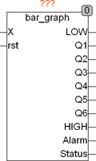
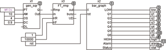
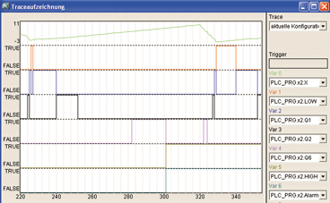

<!--
  Copyright (c) 2026 Hans Mühlbauer, Franz Höpfinger and others.

  This program and the accompanying materials are made available under the
  terms of the Eclipse Public License 2.0 which is available at
  https://www.eclipse.org/legal/epl-2.0

  SPDX-License-Identifier: EPL-2.0
-->

## Type	Funktionsbaustein

| | |
|:---|:---|
| **Input	X** | REAL (Eingangswert) |
| **RST** | BOOL (Reset Eingang für Alarm Ausgang) |
| **Output	LOW** | BOOL (TRUE, wenn X < TRIGGER_LOW) |
| **Q1 .. Q6** | BOOL (Triggerausgänge) |
| **HIGH** | BOOL (TRUE, wenn X >= TRIGGER_HIGH) |
| **ALARM** | BOOL (Alarmausgang) |
| **STATUS** | Byte (ESR Status Ausgang) |
| **Setup	TRIGGER_LOW** | REAL (Triggerschwelle für LOW Output) |
| **TRIGGER_HIGH** | REAL (Triggerschwelle für HIGH Output) |
| **ALARM_LOW** | BOOL (Enable Alarm für Low Output) |
| **ALARM_HIGH** | BOOL (Enable Alarm für High Output) |
| **LOG_SCALE** | BOOL (Ausgang ist Logarithmisch wenn TRUE) |
| | BAR_GRAPH ist ein Level Detector, der abhängig vom Eingangswert einen Ausgang aktiviert. Der Ansprechwert für die LOW und HIGH Ausgänge ist durch die Setup-Variablen TRIGGER_LOW und TRIGGER_HIGH einstellbar. LOW wird TRUE, wenn X kleiner als TRIGGER_LOW ist und HIGH wird TRUE, wenn X größer gleich TRIGGER_HIGH ist. Sind die Setup-Variablen ALARM_LOW und / oder ALARM_HIGH auf TRUE gesetzt, so wird bei unterschreiten von TRIGGER_LOW oder überschreiten von TRIGGER_HIGH der Ausgang ALARM auf TRUE gesetzt und der Ausgang LOW oder HIGH und ALARM bleibt solange auf TRUE, bis der Eingang RST TRUE wird und den Alarm zurücksetzt. Die Ausgänge Q1 bis Q6 unterteilen den Bereich zwischen TRIGGER_LOW und TRIGGER_HIGH in 7 gleiche Bereiche. Ist die Setup Variable LOG_SCALE gesetzt, so wird der Bereich zwischen TRIGGER_LOW und TRIGGER_HIGH logarithmisch aufgeteilt. |
| | Der Ausgang Status ist ein ESR kompatibler Ausgang, der Zustände und Alarme an ESR Bausteine weiterreicht. |
| **Das folgende Beispiel zeigt eine n Signalverlauf an Bar_Graph** |  |

| Status |  |
| --- | --- |
| 110 | Eingang liegt zwischen Trigger_Low und Trigger_High |
| 111 | Eingang kleiner Trigger_Low, Ausgang LOW ist TRUE |
| 112 | Eingang größer Trigger_High, Ausgang HIGH ist TRUE |
| 1 | Eingang kleiner als Trigger_low und Alarm_Low ist TRUE |
| 2 | Eingang größer als Trigger_high und Alarm_High ist TRUE |
