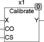

<!--
  Copyright (c) 2026 Hans Mühlbauer, Franz Höpfinger and others.

  This program and the accompanying materials are made available under the
  terms of the Eclipse Public License 2.0 which is available at
  https://www.eclipse.org/legal/epl-2.0

  SPDX-License-Identifier: EPL-2.0
-->

## Type	Funktionsbaustein

| | |
|:---|:---|
| **Input	X** | REAL (Eingangswert) |
| **CO** | BOOL (Puls zum Speichern des Offsets) |
| **CS** | BOOL (Puls zum Speichern des Verstärkungsfaktors) |
| **Output	Y** | REAL (kalibriertes Ausgangssignal) |
| **Setup	Y_OFFSET** | REAL (Y Wert bei dem der Offset gesetzt wird) |
| **Y_SCALE** | REAL (Y Wert bei dem der Verstärkungsfaktor |
| | gesetzt wird) |
| | CALIBRATE dient zum Kalibrieren eines Analogen Signals. Um ein Kalibrieren zu ermöglichen müssen 2 Referenzwerte (Y_OFFSET und Y_SCALE) durch einen Doppelklick auf das Symbol des Bausteins gesetzt werden. Y_OFFSET ist der Ausgangswert, bei dem der Offset durch einen Puls an CO gesetzt wird und Y_SCALE ist der Wert, bei dem der Verstärkungsfaktor ermittelt wird. Eine Kalibrierung ist nur dann erfolgreich, wenn zuerst Offset und danach Verstärkung kalibriert werden. |

**Beispiel:**

Beispiel: Ein Eingangssignal von 4..20 mA soll auf die Temperaturwerte von 0 .. 70 °C kalibriert werden. Hierzu werden die Setup- Variablen Y_OFFSET = 0 und Y_SCALE = 70 gesetzt. Dann wird der Sensor in Eiswasser gelegt und nach der Ansprechzeit des Sensors ein Puls am Eingang C0 ausgelöst, der den Baustein veranlasst einen Korrekturwert für Offset zu errechnen und intern abzuspeichern. Als nächstes wird dann der Sensor mit 70 °C beaufschlagt und nach der Ansprechzeit ein Puls am Eingang CS ausgelöst, wodurch im Baustein ein Verstärkungsfaktor berechnet wird, der intern gespeichert wird. Die Kalibrationswerte werden permanent gespeichert. Das heißt, sie gehen auch dann nicht verloren, wenn ein Reset ausgeführt wird oder die Stromversorgung an der SPS ausgeschaltet wird.
