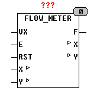

<!--
  Copyright (c) 2026 Hans Mühlbauer, Franz Höpfinger and others.

  This program and the accompanying materials are made available under the
  terms of the Eclipse Public License 2.0 which is available at
  https://www.eclipse.org/legal/epl-2.0

  SPDX-License-Identifier: EPL-2.0
-->

## FLOW_METER

| | |
|:---|:---|
| **Type** | Funktionsbaustein |
| **Input	VX** | REAL (Volumenstrom je Stunde) |
| **E** | BOOL (Enable Eingang) |
| **RST** | BOOL (Reset Eingang) |
| **I/O	X** | REAL (Flussmenge Nachkommateil) |
| **Y** | UDINT (Flussmenge Ganzzahlenteil) |
| **Output	F** | REAL (momentaner Volumenstrom) |
| | Der Funktionsbaustein FLOW_METER ermittelt den Volumenstrom / Zeiteinheit und Zählt Mengen. FLOW_METER ermittelt den Volumenstrom aus dem Eingang VX und E. Der Baustein unterstützt 2 Betriebsmodi die durch die Setup Variable PULSE_MODE bestimmt werden. Wenn PULSE_MODE = TRUE wird der Volumenstrom und die Menge ermittelt indem bei jeder steigenden Flanke an E der Wert an VX aufaddiert wird. Wenn PULSE_MODE = FALSE wird der Eingang VX als Flussmenge pro Zeiteinheit interpretiert und solange aufsummiert wie E = TRUE ist. Mittels des Eingangs RST kann der interne Zähler jederzeit auf Null gesetzt werden. X und Y sind extern zu deklarierende Variablen die auch Remanent / Permanent deklariert werden können um auch bei Stromausfall erhalten zu bleiben. Der Baustein liefert den momentanen Durchflusswert F als Real abhängig von der an VX anliegenden Einheit. Wird z.B. an VX ein Wert in Liter / Stunde angelegt so ist auch der Messwert am Ausgang F in l/h. Der Ausgang F wird in konstanten Abständen UPDATE_TIME gesetzt. Die Ausgänge X und Y bilden Zusammen den über die Zeit aufsummierten Messwert wobei X in REAL die Nachkommastellen und Y in UDINT den Ganzzahligen Teil darstellen. Ein Zählerstand von 234.111234 wird durch eine 0.111234 an X und einem Wert von 234 an Y dargestellt. Wird zur Zählung nur ein REAL verwendet so beträgt die Auflösung (für Real nach IEEE32) lediglich 7-8 Stellen. Durch die oben beschriebene Methode können insgesamt mehr als 9 Stellen vor dem Komma (2^32-1) und mindestens 7 Stellen nach dem Komma dargestellt werden. Da hierbei X immer kleiner als 1 bleibt kann für Ausgaben ohne Kommastellen nur Y alleine betrachtet werden. Die beiden Variablen X und Y müssen extern deklariert werden und können wie im folgenden Beispiel auch gegen Stromausfall gesichert werden. |
| **SETUP	PULSE_MODE** | BOOL (Puls Zähler wenn TRUE) |
| **UPDATE_TIME** | TIME (Messzeit für F) |



**Beispiel:**

```iecst
VX := 4 m³/h; PULSE_MODE := FALSE; UPDATE_TIME := T#100ms; Der Baustein misst den Durchfluss in m³/h und Zählt die Flussmenge solange wie der Eingang E auf TRUE steht. Der Ausgang F wird (4.0m³/h) zeigen solange E TRUE ist, sonst (0.0). Der Wert an F wird alle 100 Millisekunden neu Berechnet. Beispiel2: VX := 0,024 l/Puls; PULS_MODE := TRUE; UPDATE_TIME := T#1s; In diesem Beispiel wird der Durchfluss am Ausgang F in l/h angezeigt und mit jeder steigenden Flanke an E wird der Zähler um 0,024 l erhöht.
```
