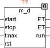

<!--
  Copyright (c) 2026 Hans Mühlbauer, Franz Höpfinger and others.

  This program and the accompanying materials are made available under the
  terms of the Eclipse Public License 2.0 which is available at
  https://www.eclipse.org/legal/epl-2.0

  SPDX-License-Identifier: EPL-2.0
-->

## Type	Funktionsbaustein

| | |
|:---|:---|
| **Input	START** | BOOL (Eingangssignal) |
| **STOP** | BOOL (Eingangssignal) |
| **TMAX** | TIME (Timeout für ET) |
| **RST** | BOOL (Reset Eingang) |
| **Output	PT** | TIME (gemessene Zeit) |
| **ET** | TIME (Abgelaufene Zeit seit letzter steigender Flanke) |
| **RUN** | BOOL (TRUE wenn Messung läuft) |
| **M_D misst die Zeit zwischen einer steigenden Flanke an START und einer steigenden Flanke an STOP. PT ist das Ergebnis der letzten Messung. Der Ausgang ET ist die abgelaufene Zeit seit der letzten steigenden Flanke an START. M_D benötigt eine steigende Flanke, um die Messung zu starten. Falls beim ersten Aufruf START bereits TRUE ist, wird dies nicht als steigende Flanke gewertet. Auch wenn STOP TRUE ist, wird eine steigende Flanke an START nicht gewertet. Nur wenn alle Startbedingungen (STOP = FALSE, RST** | = FALSE und steigende Flanke an START) vorliegen geht der Ausgang RUN auf TRUE und eine Messung wird gestartet. Mit TRUE am Eingang RST können die Ausgänge jederzeit auf 0 zurückgesetzt werden. Erreicht ET den Wert TMAX wird automatisch im Baustein ein Reset erzeugt und alle Ausgänge auf 0 zurückgesetzt. TMAX ist intern mit einem Vorgabewert von T#10d belegt und kann im Normalfall unbeschaltet bleiben. TMAX dient dazu einen maximalen Wertebereich für PT vorzugeben. Der Ausgang RUN ist TRUE wenn eine Messung läuft. |

